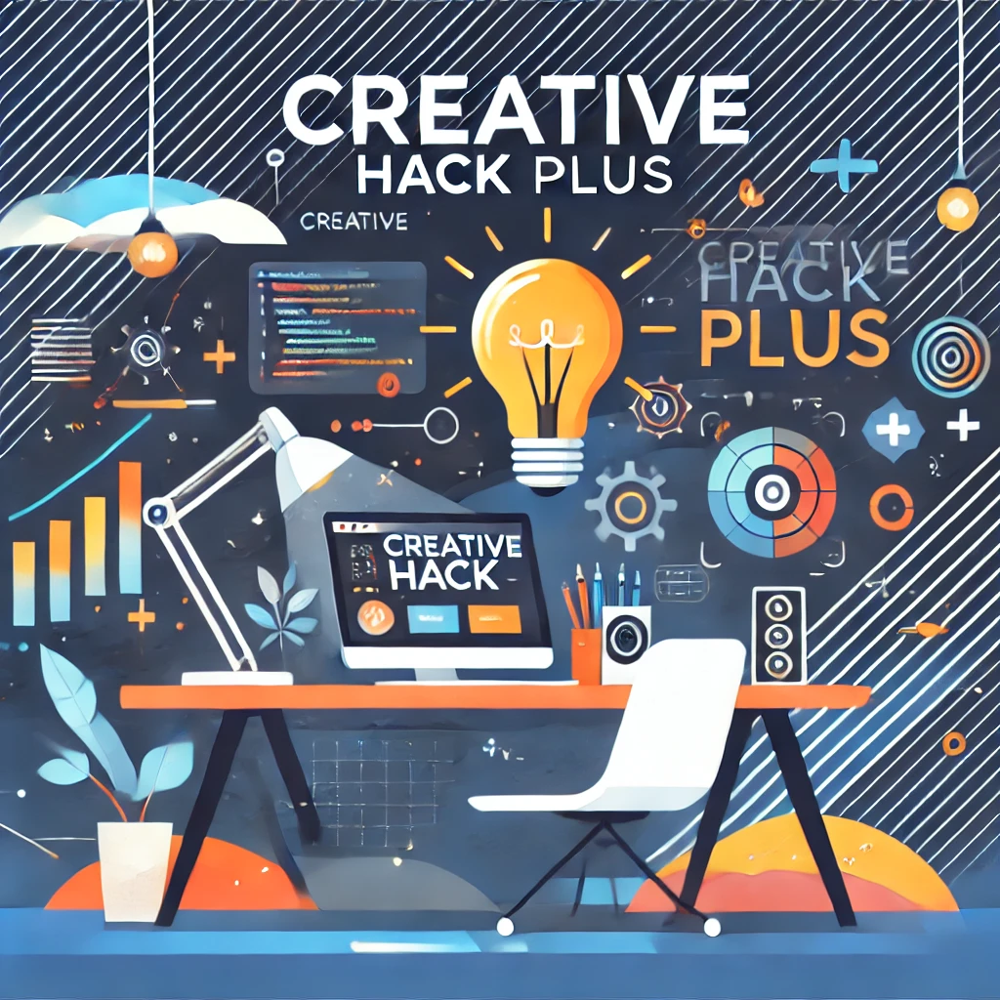
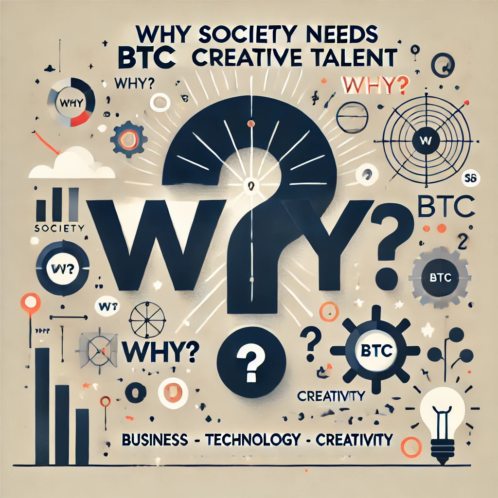
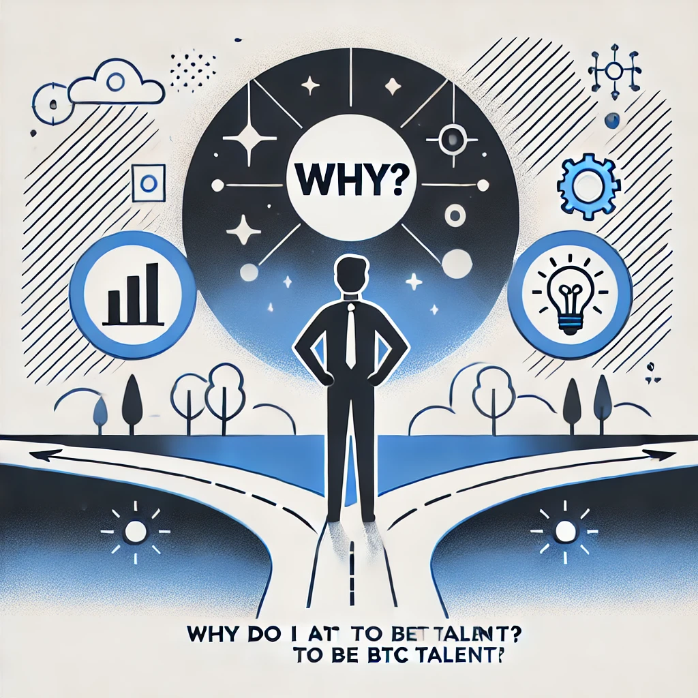
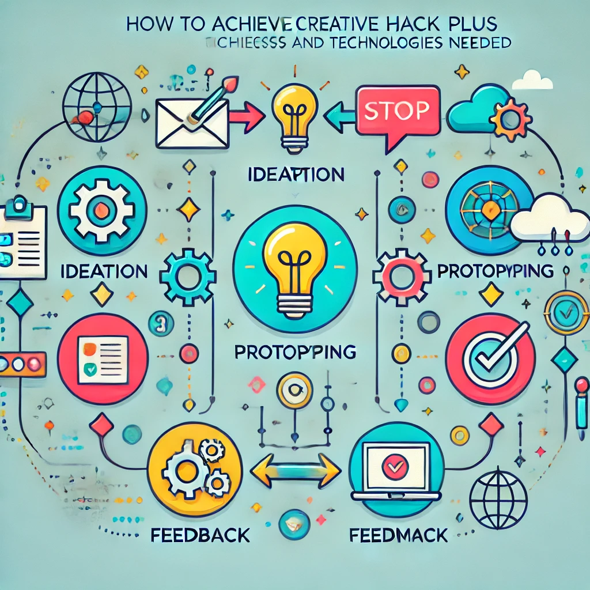

# Creative Hack Plus?

[TOC]

## 1.0. 🤝 イントロダクション (3 限前半)


by OpenAI DALL-E

### 1.1. 🙋 出欠登録 (5 分)

### 1.2. 📖 自己紹介 (5 分)

```
名前: 小島 弘誉(こじま ひろたか)
専門分野: ソフトウェア工学
略歴:
  通信事業会社にて6年、OpenStackを用いたパブリッククラウド(仮想サーバ)の開発・運用等を経験。
  本業以外でもグループ全体のアプリコンテストに出場し、UX賞、最優秀賞を受賞。
  自動車部品メーカーにて3年、XP(Extreme Programming)を用いた新規事業(アプリ、プラットフォーム)開発を経験。
  2021年12月より、日本の大企業で仮説検証を爆速に回せるか?の解を探して、現職。Solution Architectとして顧客が抱えている課題を解決するために日々、仮説検証を回す日々を奮闘中。
```

```
名前: 伊藤　尚祐(いとう なおすけ)
専門分野: 情報通信
略歴:
  大学卒業後、総合電機メーカーにて通信装置の研究開発に従事。その後、スタートアップにてIoTサービスの構築をリードした後、2022年より日本IBM。
  現在、デザイン・シンキング等で出たアイデアを短期間で実装し、ユーザー価値・ビジネス価値の最大化に挑戦中。趣味はスケートボード（パリオリンピックに感化されスタート）。
```

### 1.3. ⛏ アイスブレイク (5 分)

```
ここ1週間で、生成AI使った？
1. かなり
2. そこそこ
3. すこし
4. あまり
5. ぜんぜん
```

```
今日、何種類のサービス（アプリ）使った？
1. 0個
2. 2-5個
3. 6個以上
```

```
ハッカソンて知ってる？
1. 知らない
2. 知ってる
3. でたことある
```

```
BTC人材って知ってる？
1. 知らない
2. なんやっけ？ビットコイン？
3. 知ってる
```

### 1.4. 📝 前半の復習 (15 分)

前半のコースでは、ユーザーの観点とシステムの観点の両方から実践的なソリューション構築の流れを体験していただけたかと思います。

> [!IMPORTANT]
>
> 前半で出てきた以下のキーワードを調べてみよう。

```
1. ソリューションとは？
```

```
2. デザイン思考とは？
```

```
3. ソフトウェア開発の6フェーズ？
```

```
4. CodeSandbox とは？
```

```
5. アーキテクチャとは？
```

```
6. HTTPとは？
```

```
7. データベースとは？
```

```
8. セキュリティ対策にはどんなものがある？
```

```
9. DevOpsとは？
```

```
10. SaaS, PaaS, IaaSとは？
```

```
11. 仮想マシン、コンテナとは？
```

```
12. ペルソナとは？
```

```
13. ストーリーボードとは？
```

```
14. ユーザーストーリマップ とは？
```

```
15. プロトタイプ、MVPとは？
```

| 回数     |         1          |               2                |               3                |                  4                  |                  5                  |                    6                    |                  7                  |        8-14         |
| -------- | :----------------: | :----------------------------: | :----------------------------: | :---------------------------------: | :---------------------------------: | :-------------------------------------: | :---------------------------------: | :-----------------: |
| テーマ   | ソリューション基礎 | ソリューションとデザイン思考 ① | ソリューションとデザイン思考 ② | ソリューションとテクノロジー ① 設計 | ソリューションとテクノロジー ② 開発 | ケーススタディ ① ソリューションデザイン | ケーススタディ ② ソリューション開発 | Creative Hack Plus  |
| 担当講師 |     小島、竹田     |              竹田              |              竹田              |                小島                 |                小島                 |               小島、竹田                |             小島、竹田              |     伊藤、小島      |
| 場所     |     オンサイト     |           オンサイト           |            リモート            |             オンサイト              |              リモート               |                リモート                 |             オンサイト              | オンサイト/リモート |

### 1.5. 📌 コース概要 (5 分)

このコースの後半 7 回では、前半で身につけたデザイン思考やシステム設計開発のスキルをさらに発展し、ワークショップやハンズオン、ハッカソンを通して手を動かしながら、他者と協力し目の前の課題に深く向き合い解決方法を探る力を身につけます。


by OpenAI DALL-E

|   回数   |          1          |            2             |      3       |      4       |           5           |           6           |           7           |
| :------: | :-----------------: | :----------------------: | :----------: | :----------: | :-------------------: | :-------------------: | :-------------------: |
|   日程   |        11/27        |          12/04           |    12/11     |    12/18     |         12/25         |          1/8          |         1/15          |
|  テーマ  | Creative Hack Plus? | アジャイルワークショップ | ハンズオン#1 | ハンズオン#2 | ミニハッカソン#1 計画 | ミニハッカソン#2 実装 | ミニハッカソン#3 発表 |
| 担当講師 |        伊藤         |        伊藤、小島        |     伊藤     |     伊藤     |      伊藤、小島       |      伊藤、小島       |      伊藤、小島       |
|   場所   |      リモート       |        オンサイト        |   リモート   |   リモート   |      オンサイト       |      オンサイト       |      オンサイト       |

「Creative Hack Plus」は今まで学んだソリューションの呼び方を変えたもので、コース後半のテーマです。クリエイティブなアイデアや手法を活用して既存の問題を新たな視点で解決し、価値を創造することを指します。既存の枠組みにとらわれない「Creative」と「Hack」が本来持つ「効率的な解決法」や「機転を利かせた手段」という意味に「Plus」を加えることで、個人の課題解決にとどまらず、他者の課題解決や持続可能なビジネスモデルの提案へと発展させる意図を込めました。また、クロステックデザインコースで重視している BTC（Business Technology Creative）とも以下のように対応しています。

| **Creative Hack Plus** | **Business Technology Creative** | **説明**                                                                             |
| ---------------------- | -------------------------------- | ------------------------------------------------------------------------------------ |
| **Creative**           | Creative                         | 新しい視点や発想で問題を解決する創造性。                                             |
| **Hack**               | Technology                       | 技術を活かして迅速かつ柔軟に課題に取り組む姿勢。                                     |
| **Plus**               | Business                         | 個人の課題解決を越えた持続可能な価値創造、ビジネスモデルの構築、社会へのインパクト。 |

### 1.6. 🎯 今日のゴール (10 分)

「Creative Hack Plus」に込めた意味（クリエイティブなアイデアや手法を活用して既存の問題を新たな視点で解決し、価値を創造する）、もしくは BTC 人材について以下の項目を考えます。

- なぜ、社会が BTC 人材を求めているのか（もしくは求めていないのか）
- なぜ、私は BTC 人材を目指すのか（もしくは目指さないのか）
- どうやって、Creative Hack Plus を実現するのか（どんなプロセス・テクノロジーが必要か）

> [!IMPORTANT]
>
> [Mural](https://app.mural.co/)を使います

## 2.0. 🤔 なぜ、社会が BTC 人材を求めているのか（もしくは求めていないのか） (3 限後半)


by OpenAI DALL-E

> [!TIP]
>
> - 検索歓迎
> - 生成 AI に聞くの歓迎
> - 他の人とかぶるの歓迎

### 2.1. 🚀 BTC (Business Technology Creative) 人材 ? (10 分)

> クロステックの学生というのは、デザインも企画も、テクノロジーで何ができるかも理解し、その上でビジネスの視点でいかにマネタイズしていくかを考えられる人材です。この BTC（ビジネス・テクノロジー・クリエイティブ）を理解し、自らの得意分野をもった卒業生は、社会のいたるところで高い評価を受けています。

[クロステックデザインコース | 京都芸術大学](https://www.kyoto-art.ac.jp/department/x-techdesign/)

> BTC 型人材
> BTC とは「ビジネス」「テクノロジー」「クリエイティブ」の頭文字。3 つの専門性を併せ持った人材のことを指している。

[つくるだけで完結しない、社会に「実装」させる美大教育 京都芸術大学の現在 vol.2 | TD](https://www.td-media.net/interview/kyoto-art-daisaku-yoshida/)

> 特に新しいものをつくろうとしたときには、ビジネスやる人と、テクノロジーやる人と、UX とかデザインやる人が完全に分業してる状態だとあまりいいものはできないんですね。ワークするものができない。
> 何でかっていうとビジネスにおける正義と、テクノロジーにおける正義と、デザインにおける正義って常にすれ違うわけです。ただ僕らが日々当たり前に使っているようなものっていうのは、大体この 3 方向から見たときにスイートスポットにちゃんとピタッとはまっている。そういうものしか残らない。

[デザイン経営を牽引する BTC 型人材とは～ Takram 田川欣哉氏出版記念イベント | GLOBIS 学び放題 × 知見録](https://globis.jp/article/7214/)

> ただし、学生にはすべて完璧にこなさなくてもいいよと伝えています。テクノロジーやビジネスのことを知らないクリエイターは、問題を解決するためにクリエイティブだけで突破しようとするけど、自分に足りないものがわかっている人は、それを補える人と組めばいいと考えることができます。だから、一人で綺麗な BTC（ビジネス・テクノロジー・クリエイティブ）の三角形を作らなくてよくて、むしろどこかを尖らせるようにと言っています。

[つくるだけで完結しない、社会に「実装」させる美大教育 京都芸術大学の現在 vol.2 | TD](https://www.td-media.net/interview/kyoto-art-daisaku-yoshida/)

[solution-design-with-technology/2024/1_solution_basic/5. ソリューションデザインと多様性](https://github.com/Creative-Cucumbers/solution-design-with-technology/tree/main/2024/1_solution_basic#52-%E3%82%BD%E3%83%AA%E3%83%A5%E3%83%BC%E3%82%B7%E3%83%A7%E3%83%B3%E5%AE%9F%E7%8F%BE%E3%81%99%E3%82%8B%E3%81%9F%E3%82%81%E3%81%AE%E5%BD%B9%E5%89%B2)

### 2.2. 🤷‍♂️ Why (20 分)

> [!IMPORTANT]
>
> BTC 人材が求められている理由を**最低 3 個**書いてみよう

> [!IMPORTANT]
>
> BTC 人材が求められている理由をさらに **最低 3 個**書いてみよう

> [!IMPORTANT]
>
> 似たものを寄せて、カテゴリーに名前をつけてみよう

### 2.3. 🤷‍♂️ Why NOT (20 分)

> [!IMPORTANT]
>
> BTC 人材が求められていない領域を**最低 3 個**書いてみよう

> [!IMPORTANT]
>
> ビジネス・テクノロジー・クリエイティブ以外に重要だと思うことを**最低 3 個**書いてみよう

> [!IMPORTANT]
>
> AI で置き換えられそうな人材を**最低 3 個**書いてみよう

## 3.0. 🤔 なぜ、私は BTC 人材を目指すのか（もしくは目指さないのか） (4 限前半)


by OpenAI DALL-E

> [!TIP]
>
> - 検索歓迎
> - 生成 AI に聞くの歓迎
> - 他の人とかぶるの歓迎

### 3.1. 🤷‍♂️ Why (20 分)

> [!IMPORTANT]
>
> BTC 人材を目指す理由を**最低 3 個**書いてみよう

> [!TIP]
>
> - 自身の強み
> - 自分の性格
> - 自分の嗜好性
> - 今までの経験
> - あこがれる人物像

> [!IMPORTANT]
>
> BTC 人材を目指す理由をさらに**最低 3 個**書いてみよう

> [!IMPORTANT]
>
> 似たものを寄せて、カテゴリーに名前をつけてみよう

### 3.2. 🤷‍♂️ Why NOT (15 分)

> [!IMPORTANT]
>
> BTC 以外の身につけたいスキルを**最低 3 個**書いてみよう

> [!IMPORTANT]
>
> **目指さない人材**を**最低 3 個**書いてみよう

## 4.0. 🧐 どうやって、Creative Hack Plus を実現するのか（どんなプロセス・テクノロジーが必要か） (4 限後半)


by OpenAI DALL-E

> [!TIP]
>
> - 検索歓迎
> - 生成 AI に聞くの歓迎
> - 他の人とかぶるの歓迎

### 4.1. ⚙️ プロセス (20 分)

> [!IMPORTANT]
>
> Creative Hack Plus（クリエイティブなアイデアや手法を活用して既存の問題を新たな視点で解決し、価値を創造する）に必要なプロセスを**最低 3 個**書いてみよう

> [!IMPORTANT]
>
> 似たものを寄せて、カテゴリーに名前をつけてみよう

> [!IMPORTANT]
>
> Creative Hack Plus とは相性の悪いプロセスを**最低 3 個**書いてみよう

### 4.2. 💻 テクノロジー (20 分)

> [!IMPORTANT]
>
> Creative Hack Plus（クリエイティブなアイデアや手法を活用して既存の問題を新たな視点で解決し、価値を創造する）に必要なテクノロジーを**最低 3 個**書いてみよう

> [!IMPORTANT]
>
> 似たものを寄せて、カテゴリーに名前をつけてみよう

> [!IMPORTANT]
>
> Creative Hack Plus とは相性の悪いテクノロジーを**最低 3 個**書いてみよう

## 5.0. 👉 今後

### 5.1. 🔺 WILL・CAN・MUST (5 分)

上記 3 つのテーマは、キャリアを考える上で、よく言われる 3 要素 WILL・CAN・MUST に対応します。MUST だとクリエイティブ感が少なくオペレーション感が出てしまうので、EXPECTED に置き換えても良いかと思います。次回以降では、WILL の解像度を上げ、MUST (EXPECTED) のアンテナを増やすと共に、体験を通して CAN を増やしていきます。

<svg width="400" height="400" xmlns="http://www.w3.org/2000/svg">

  <!-- Red circle for "WILL" -->
  <circle cx="200" cy="100" r="80" fill="red" opacity="0.4" />
  <text x="200" y="105" font-size="20" fill="black" text-anchor="middle" dominant-baseline="middle">
    WILL
  </text>

  <!-- Blue circle for "CAN" -->
  <circle cx="140" cy="200" r="80" fill="blue" opacity="0.3" />
  <text x="140" y="205" font-size="20" fill="black" text-anchor="middle" dominant-baseline="middle">
    CAN
  </text>

  <!-- Yellow circle for "MUST" -->
  <circle cx="260" cy="200" r="80" fill="yellow" opacity="0.4" />
  <text x="260" y="205" font-size="20" fill="black" text-anchor="middle" dominant-baseline="middle">
    MUST
  </text>
</svg>

### 5.2. 👩‍💻 プロセスとテクノロジー (5 分)

具体的には、ハンズオンやワークショップ、ハッカソンを通してテクノロジーを重点的に改めて下記について学んでいきます。

- **プロセス**
  - アジャイル開発
  - デザイン思考
  - ビジネスモデルキャンバス
- **テクノロジー**
  - Web アプリケーション
  - ローコード・ノーコードツール
  - AI

## A. 参考

- [令和３年度ＡＩ人材連携による中小企業課題解決促進事業（企業と連携するデジタル人材に関する調査）調査報告書 2022 年 3 月 みずほリサーチ＆テクノロジーズ株式会社](https://www.meti.go.jp/meti_lib/report/2021FY/000212.pdf)
- [デザイン経営を牽引する BTC 型人材とは～ Takram 田川欣哉氏出版記念イベント | GLOBIS 学び放題 × 知見録](https://globis.jp/article/7214/)
- [デジタルスキル標準（DSS）策定の背景・目的 | デジタル人材の育成 | IPA 独立行政法人 情報処理推進機構](https://www.ipa.go.jp/jinzai/skill-standard/dss/about.html)
- [リーン・スタートアップ | エリック・リース, 伊藤 穣一(MIT メディアラボ所長), 井口 耕二 |本 | 通販 | Amazon](https://www.amazon.co.jp/%E3%83%AA%E3%83%BC%E3%83%B3%E3%83%BB%E3%82%B9%E3%82%BF%E3%83%BC%E3%83%88%E3%82%A2%E3%83%83%E3%83%97-%E3%82%A8%E3%83%AA%E3%83%83%E3%82%AF%E3%83%BB%E3%83%AA%E3%83%BC%E3%82%B9/dp/4822248976)
