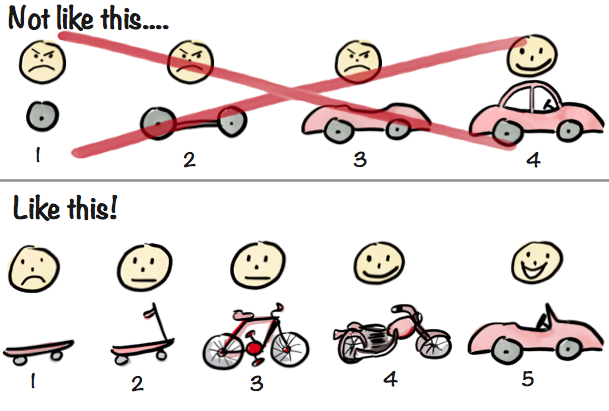

# マシュマロチャレンジ

## マシュマロチャレンジ？

顧客「大好きなマシュマロと大好きなパスタを使って高い塔を建てたい！」
顧客「塔は高ければ高いほど良い！」
顧客「マシュマロの位置は高ければ高いほど良い！」

→ どうする？

## 流れ

### 3 限前半

- 出欠 5min
- 説明 10min
- チーム分け 5min
- チャレンジ#1 20min
- 計測＆結果発表＆感想#1 10min
- 休憩 5min

### 3 限後半

- 振り返り#1 10min
- チャレンジ#2 20min
- 計測＆結果発表＆感想#2 10min
- 休憩 20min

### 4 限前半

- マシュマロチャレンジとアジャイル開発 30min
- 振り返り#2 15min
- 休憩 5min

### 4 限前半

- チャレンジ#3 20min
- 計測＆結果発表＆感想#3 10min
- まとめ 15min
- アンケート 5min

## マシュマロチャレンジで利用するもの

- 乾燥パスタ：20 本（1.7mm）
- マスキングテープ：90cm
- ひも ：90cm
- マシュマロ：1 つ
- はさみ：1 つ

## マシュマロチャレンジのルール

- 1 チーム約 4 人で、作戦タイムも含めて 18 分間で行います。
- 自立可能で出来るだけ高いタワーを立て、タワーの上にマシュマロを置きます。（パスタに刺しても OK です）
- テープで足場を固定してはいけません。
- パスタやテープ、ひもは切ったり、貼ったりするのは OK です。 マシュマロは切ってはいけません。
- 計測の最中もタワーが立っていなければ、記録とはなりません。

## マシュマロチャレンジ #1 スタート！

- 1 チーム約 4 人で、作戦タイムも含めて 18 分間で行います。
- 自立可能で出来るだけ高いタワーを立て、タワーの上にマシュマロを置きます。（パスタに刺しても OK です）
- テープで足場を固定してはいけません。
- パスタやテープ、ひもは切ったり、貼ったりするのは OK です。 マシュマロは切ってはいけません。
- 計測の最中もタワーが立っていなければ、記録とはなりません。

## 計測＆結果発表＆感想 #1

- どういう作戦だった？
- どんな役割分担？
- 何が難しかった？

## 振り返り #1

- 良かった点、悪かった点、気付きを共有しよう

## マシュマロチャレンジ #2 スタート！

- 1 チーム約 4 人で、作戦タイムも含めて 18 分間で行います。
- 自立可能で出来るだけ高いタワーを立て、タワーの上にマシュマロを置きます。（パスタに刺しても OK です）
- テープで足場を固定してはいけません。
- パスタやテープ、ひもは切ったり、貼ったりするのは OK です。 マシュマロは切ってはいけません。
- 計測の最中もタワーが立っていなければ、記録とはなりません。

## 計測＆結果発表＆感想 #2

- どういう作戦だった？
- どんな役割分担？
- 何が難しかった？

## マシュマロチャレンジとアジャイル開発

マシュマロチャレンジはソリューション開発！
マシュマロチャレンジはソフトウェア開発！！
マシュマロチャレンジはアジャイル開発！！！

### マシュマロチャレンジとはなんだったのか？

- 顧客ニーズ：マシュマロをより高くかかげるタワー
- 手段：パスタ
- 解決方法：マシュマロチャレンジ

→ ソリューション開発であり、またソフトウェア開発であり、アジャイル開発でもある

### アジャイルの言葉の意味は？

『すばやい』『俊敏な』

### 一言で言うと？

**変化に柔軟に適応して価値を最大化**

### アジャイルソフトウェア開発宣言

プロセスやツールよりも個人と対話を、
包括的なドキュメントよりも動くソフトウェアを、
契約交渉よりも顧客との協調を、
計画に従うことよりも変化への対応を、

[アジャイルソフトウェア開発宣言](https://agilemanifesto.org/iso/ja/manifesto.html)

### アジャイル宣言の背後にある原則

- 顧客満足を最優先し、価値のあるソフトウェアを早く継続的に提供します。
- 要求の変更はたとえ開発の後期であっても歓迎します。変化を味方につけることによって、お客様の競争力を引き上げます。
- 動くソフトウェアを、2-3 週間から 2-3 ヶ月というできるだけ短い時間間隔でリリースします。
- ビジネス側の人と開発者は、プロジェクトを通して日々一緒に働かなければなりません。
- 意欲に満ちた人々を集めてプロジェクトを構成します。環境と支援を与え仕事が無事終わるまで彼らを信頼します。
- 情報を伝えるもっとも効率的で効果的な方法はフェイス・トゥ・フェイスで話をすることです。
- 動くソフトウェアこそが進捗の最も重要な尺度です。
- アジャイル･プロセスは持続可能な開発を促進します。一定のペースを継続的に維持できるようにしなければなりません。
- 技術的卓越性と優れた設計に対する不断の注意が機敏さを高めます。
- シンプルさ（ムダなく作れる量を最大限にすること）が本質です。
- 最良のアーキテクチャ・要求・設計は、自己組織的なチームから生み出されます。
- チームがもっと効率を高めることができるかを定期的に振り返り、それに基づいて自分たちのやり方を最適に調整します。

[アジャイル宣言の背後にある原則](https://agilemanifesto.org/iso/ja/principles.html)

### アジャイル開発の前提

事前にすべてを正確に予測し、計画することはできない

### あらためてアジャイル開発とは？

- 関係者は目的の達成のためにお互いに協力し合いながら進める
- 一度にまとめてではなく少しずつ作り、早い段階から実際に動作するものを届け続けて評価を繰り返す
- 利用者の反応や関係者からのフィードバックを駅属的に得ながら、作っているもの自体や計画を調整する

[SCRUM BOOT CAMP THE BOOK【増補改訂版】 スクラムチームではじめるアジャイル開発 | 西村 直人, 永瀬 美穂, 吉羽 龍太郎 |本 | 通販 | Amazon](https://www.amazon.co.jp/SCRUM-BOOT-CAMP-BOOK%E3%80%90%E5%A2%97%E8%A3%9C%E6%94%B9%E8%A8%82%E7%89%88%E3%80%91-%E3%82%B9%E3%82%AF%E3%83%A9%E3%83%A0%E3%83%81%E3%83%BC%E3%83%A0%E3%81%A7%E3%81%AF%E3%81%98%E3%82%81%E3%82%8B%E3%82%A2%E3%82%B8%E3%83%A3%E3%82%A4%E3%83%AB%E9%96%8B%E7%99%BA/dp/4798163686)

### MVP: Minimum Viable Product

プロダクト開発における最小限の機能を持つ製品

MVP の主な目的は、市場やユーザーからのフィードバックを早期に得ることであり、無駄を最小限に抑えつつ効果的に開発を進めること。



#### 特徴

- 最小限の機能
- 早期リリース
- フィードバック重視

[Making sense of MVP (Minimum Viable Product) - and why I prefer Earliest Testable/Usable/Lovable - Crisp's Blog](https://blog.crisp.se/2016/01/25/henrikkniberg/making-sense-of-mvp)

#### メリット

- コスト削減
- リスク軽減
- 学習サイクル

#### デメリット

- 最小限の機能ではユーザーの期待を満たせない場合がある

## 振り返り #2

- 良かった点、悪かった点、気付きを共有しよう

## マシュマロチャレンジ #3 スタート！

- 1 チーム約 4 人で、作戦タイムも含めて 18 分間で行います。
- 自立可能で出来るだけ高いタワーを立て、タワーの上にマシュマロを置きます。（パスタに刺しても OK です）
- テープで足場を固定してはいけません。
- パスタやテープ、ひもは切ったり、貼ったりするのは OK です。 マシュマロは切ってはいけません。
- 計測の最中もタワーが立っていなければ、記録とはなりません。

## 計測＆結果発表＆感想 #3

- どういう作戦だった？
- どんな役割分担？
- 何が難しかった？

## まとめ

[Tom Wujec: Build a tower, build a team | TED Talk](https://www.ted.com/talks/tom_wujec_build_a_tower_build_a_team/transcript?subtitle=ja&language=ja)

### 動画メモ

- 幼稚園児の方が結果が良い！？
  - 試行錯誤が大事
- ファシリテーターがいると結果が良くなる！？
  - 円滑なチームコミュニケーションが大事
- 賞金が出ると結果が悪い！？
  - 報酬と成果の関係はシンプルじゃない

### 学びと好きな言葉

- If you want to go fast, go alone. If you want to go far, go together.
  早く行きたければ一人で行け、遠くへ行きたければみんなで行け
  アフリカのことわざ
- Fail fast
  速く失敗せよ
  Silicon Valley startup culture
- Done is better than perfect
  完璧を目指すよりまず終わらせろ
  Mark Elliot Zuckerberg

## 参考

[Tom Wujec: Build a tower, build a team | TED Talk](https://www.ted.com/talks/tom_wujec_build_a_tower_build_a_team/transcript?subtitle=ja&language=ja)
[日本マシュマロチャレンジ協会 - 日本マシュマロチャレンジ協会](http://www.marshmallow-challenge-japan.org/)
[マシュマロチャレンジとは？実施方法、コツ、実施動画を紹介   | IKUSA.JP](https://ikusa.jp/2023072444130)

## メモ

- ゴミ袋
- お菓子
- 景品
- メジャー
- ハサミ
- 追加パスタ
- ウェットティッシュ

## プロンプトメモ

```
以下の情報をもとに、以下の形式でスライドを作成してください。

- React x TypeScript
- シンプルでフラットでモダンなデザイン
- 画面サイズは16:9
- できるだけアイコンを利用
- ページ送りはカーソルキー
- モダンな日本語フォントを利用
- できるだけ大きい文字で
```

```
以下の情報をもとに、以下の形式でスライドのようなwebサイトを作成してください。

- React x TypeScript
- シンプルでフラットでモダンなデザイン
- 画面サイズは16:9
- できるだけアイコンを利用
- ページ送りはカーソルキー
- モダンな日本語フォントを利用
- できるだけ大きい文字で
```
