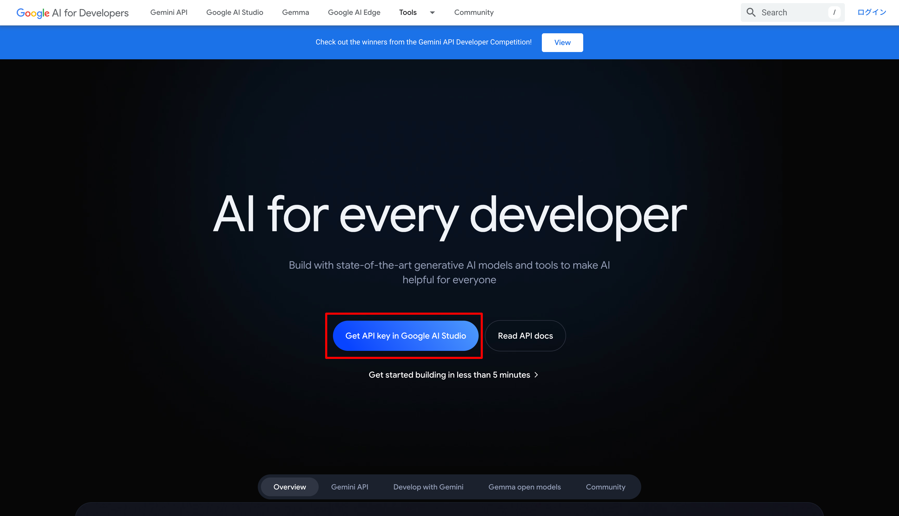
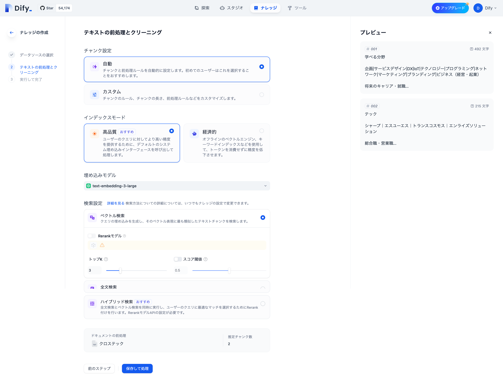

# 🤝 ハンズオン#1

by OpenAI DALL-E

[TOC]

---

## 3 限目前半

## 1. ▶️ イントロダクション

---

### 1.1. 🙋 出欠登録

---

### 1.2. 📌 コース概要

このコースの後半 7 回では、前半で身につけたデザイン思考やシステム設計開発のスキルをさらに発展し、ワークショップやハンズオン、ハッカソンを通して手を動かしながら、他者と協力し目の前の課題に深く向き合い解決方法を探る力を身につけます。

by OpenAI DALL-E

---

### 1.3. 📅 スケジュール

|   回数   |          1          |            2             |      3       |      4       |           5           |           6           |           7           |
| :------: | :-----------------: | :----------------------: | :----------: | :----------: | :-------------------: | :-------------------: | :-------------------: |
|   日程   |        11/27        |          12/04           |    12/11     |    12/18     |         12/25         |          1/8          |         1/15          |
|  テーマ  | Creative Hack Plus? | アジャイルワークショップ | ハンズオン#1 | ハンズオン#2 | ミニハッカソン#1 計画 | ミニハッカソン#2 実装 | ミニハッカソン#3 発表 |
| 担当講師 |        伊藤         |        伊藤、小島        |     伊藤     |     伊藤     |      伊藤、小島       |      伊藤、小島       |      伊藤、小島       |
|   場所   |      リモート       |        オンサイト        |   リモート   |   リモート   |      オンサイト       |      オンサイト       |      オンサイト       |

---

### 1.4. 👩‍💻 Creative Hack Plus と BTC (Business Technology Creative)

「Creative Hack Plus」は今まで学んだソリューションの呼び方を変えたもので、コース後半のテーマです。クリエイティブなアイデアや手法を活用して既存の問題を新たな視点で解決し、価値を創造することを指します。既存の枠組みにとらわれない「Creative」と「Hack」が本来持つ「効率的な解決法」や「機転を利かせた手段」という意味に「Plus」を加えることで、個人の課題解決にとどまらず、他者の課題解決や持続可能なビジネスモデルの提案へと発展させる意図を込めました。また、クロステックデザインコースで重視している BTC（Business Technology Creative）とも以下のように対応しています。

| **Creative Hack Plus** | **Business Technology Creative** | **説明**                                                                             |
| ---------------------- | -------------------------------- | ------------------------------------------------------------------------------------ |
| **Creative**           | Creative                         | 新しい視点や発想で問題を解決する創造性。                                             |
| **Hack**               | Technology                       | 技術を活かして迅速かつ柔軟に課題に取り組む姿勢。                                     |
| **Plus**               | Business                         | 個人の課題解決を越えた持続可能な価値創造、ビジネスモデルの構築、社会へのインパクト。 |

---

### 1.5. 🍡 前回振り返り

マシュマロとパスタを使ってタワーを作る「マシュマロチャレンジ」に挑戦してもらいました。この活動では、チームで何度も試行錯誤しながら議論を重ね、工夫してタワーを改良する体験をしてもらいました。マシュマロを通じて、アジャイルの考え方を体感してもらえたかと思います。BBQ でマシュマロを食べるとき、家でパスタを茹でるときはぜひ思い出してください。

---

### 1.6. 本日の内容

前回学んだアジャイル開発を実践するため、AI アプリの作成を体験します。今回は、大学生活で役立つ AI アプリをテーマに取り組みます。開発には、AI アプリ開発プラットフォーム「Dify」を使用します。

### 1.6. 本日の作成物

- 関西弁チャットボット
- 授業レポート作成支援アプリ
- 作品ダメ出しアプリ
- 検索で拡張したチャットアプリ
- Web サイト理解促進アプリ

## 2. AI アプリ開発ツール

MVP (Minimum Viable Product)やプロトタイピングに有用なツール
全てをコーディングして作る？→OSS や既存のシステムや他社の仕組みを有効活用
プロトタイピング → できるだけ早く。使い慣れた道具やサービスを
プラットフォーム・エコシステム

### 2.1. ローコード・ノーコードツール

手軽なツールで迅速にプロトタイプを作成。

### 2.2. Dify 設定

下記手順で、Dify のサインアップ（アカウント作成）をしていきます。アカウントは、大学のアカウントを利用してください。個人アカウントでも問題ありません。

[Dify.AI · The Innovation Engine for Generative AI Applications](https://dify.ai/)

Get Started を選択します。

日本語を設定します。

Google で続行します。

大学のアカウントを選択します。（個人アカウントでも結構です。）

利用規約を確認します。

ログインできたことを確認します。

これで、Dify を使える状態になりました。
ただし、無料枠で利用できる範囲には限界があるため、以下で無料の Google Gemini API を登録していきます。

### 2.3. Google Gemini API

下記手順で、Google アカウントを使って API key を発行し、Dify に登録します。
大学のアカウントでは制限がかかっているため、個人アカウントでお願いします。
請求先（クレジットカード）を登録しなければ、請求が発生することはないはずですが、API key の管理には十分に注意してください。
不安な方や個人アカウントを使いたくない方は、別途準備した API key を共有します。

#### Dify 設定

設定画面に移動します。

モデルプロバイダーを選択します。

Gemini のセットアップを選択します。

Google の API key 取得画面に遷移します。

#### API key の作成

リンク先は下記サイトになっているはずです。
[Google AI Studio |Gemini API |Google for Developers  |  Google AI for Developers](https://ai.google.dev/aistudio?hl=ja)

上記サイトからログインし API key を取得していきます。

ログイン（サインイン）します。

大学のアカウントを選択した場合、以下のような画面が出るはずです。権限がないため、個人アカウントでお願いします。

API key を取得します。

利用規約等を確認します。

API key を作成します。

しばらく待ちます。

完了したらコピーします。

[お支払い]に移動で請求を確認します。

請求先アカウントが登録されていないことを確認します。

ログインし直すと表示が「無料」になりました。

#### Dify 設定

Dify の画面に戻って、API key を貼り付けます。

以下のような表示に切り替わります。

これで、API key の取得は完了です。

#### 参考

料金は以下となっています。2024-12 現在、無料で使う場合はいくつかの制約があります。

[Gemini API の料金  |  Google AI for Developers](https://ai.google.dev/pricing?hl=ja)

### 2.3. チャット機能の開発

チャット機能を作成していきます。

最初から作成を選択します。

必要な箇所を入力し作成します。

手順とモデルを設定します。

パラメータはそのままにします。

右側の画面で試しに「ハロー」と入力しました。

公開する、更新、アプリを実行をクリックして公開してみましょう。

以下のような画面が表示されます。Start Chat します。

画面下に入力欄があります。

会話を続けると、よくあるようなチャット画面に会話履歴が表示されます。

これで、チャット機能をリリースできました。

> [!IMPORTANT]
>
> 自分の考えたキャラの AI を作ってみよう

## 3 限目後半

## 3. アジャイル開発の流れ

### 3.1. アジャイル開発の準備

#### インセプションデッキ

プロジェクトの目的や方向性を明確にし、チームの共通理解を深める。

TODO 準備

#### ビジネスモデルキャンバス

ビジネスの全体像を 9 つの要素で視覚的に整理し、価値創造や収益化の仕組みを一目で把握できるツール。

TODO 準備

#### ユーザーストーリーマッピング

ユーザー視点で要件を整理し、全体像を可視化。

TODO 準備

#### リリースプランニング

リリースプランニングとは、製品や機能をリリースするタイミングや内容を計画し、顧客価値を最大化するための戦略的なプロセスです。

TODO 準備

---

### 3.2. タスク管理と計画

#### バックログ作成

必要なタスクをリスト化し、優先順位をつける。

TODO 準備

#### チケット管理とカンバン

タスクを視覚化し、進捗を効率的に管理。

TODO 準備

#### 見積もり

タスクの大きさを見積もる。

| **項目**               | **T シャツサイズ見積もり**                                                          | **ストーリーポイント見積もり**                                                         |
| ---------------------- | ----------------------------------------------------------------------------------- | -------------------------------------------------------------------------------------- |
| **概要**               | タスクの規模を「T シャツサイズ」（XS, S, M, L, XL, XXL など）で直感的に評価する手法 | タスクの複雑さ、労力、不確実性を総合的に評価し、数値（通常フィボナッチ数列）で表す手法 |
| **具体例**             | - XS: 単純で短時間で終わる - M: 標準的な規模 - XL: 非常に大きなタスク         | - 1: 簡単な作業 - 5: 標準的なタスク - 13: 非常に複雑で時間がかかる作業           |
| **適用場面**           | - 初期のバックログ整理 - 全体像を把握する計画段階                                | - スプリント計画 - タスク管理ツールでの進捗管理 - チームのベロシティ計算         |
| **メリット**           | - 簡単で直感的 - 迅速に見積もりが可能                                            | - チーム全体で基準を共有できる - 長期的な計画や進捗追跡の精度が向上                 |
| **デメリット**         | - 精度が低く、詳細な計画には不向き                                                  | - 初期段階での大まかな全体像の把握には適さない                                         |
| **主な使用方法**       | チーム内でタスクを大まかに比較し、サイズを割り当てる                                | タスクを相対的に評価し、ポイントを割り当てる                                           |
| **評価結果の表現方法** | 規模のカテゴリ（XS, S, M, L, XL, XXL など）                                         | 数値（通常はフィボナッチ数列: 1, 2, 3, 5, 8, 13, 21...）                               |

---

### 3.3. 開発プロセス

#### ペアプログラミング

- 2 人 1 組で 1 台のコンピュータを使用。
- 役割:
  - **ドライバー**: 実際にコードを書く。
  - **ナビゲーター**: コードをレビューしながらサポート。
- **メリット**:
  - コードの品質向上。
  - 知識共有やスキル向上。

#### リファクタリング

- コードの機能を変えずに内部構造を改善。
- 主な目的:
  - コードの読みやすさを向上。
  - 長期的な保守性の確保。

#### CICD (継続的インテグレーションと継続的デリバリー)

- **継続的インテグレーション (CI)**:
  - コードを頻繁に統合し、自動テストを実行。
  - バグを早期に発見。
- **継続的デリバリー (CD)**:
  - デプロイ可能な状態を常に維持。
  - ユーザーへの迅速なリリースを実現。
- **メリット**:
  - リリースの安定性が向上。
  - 開発スピードの加速。

---

## 4 限目前半

## 4. 開発

### 4.1. 機能 1「よく使う質問テンプレート」

次は、チャットボットではなく、1 つの入力に対して 1 つの出力を生成するアプリを作成します。

テキストジェネレーターを選択します。

接頭辞プロンプトに以下のような内容を入力します。
`{{query}}`部分に、ユーザーからの入力が埋め込まれます。
右上のモデルも忘れずに Gemini 1.5 Flash を選択してください。

公開されたアプリは以下のような UI になっている。

> [!IMPORTANT]
>
> 授業や日々の生活で活用できそうなアプリを作成してみよう。

### 4.2. 機能 2「画像入力」

テキストジェネレーターを選択します。

接頭辞プロンプトの入力、変数の削除、ビジョンの有効化、モデルの設定を実施します。

公開されたアプリは以下のようになりました。画像をアップロードし、Execute することで、画像に対するコメントを生成できました。

### 4.3. RAG: Retrieval Augmented Generation

## 4 限目後半

### 4.4. 機能 3「ナレッジをもとにした質疑応答」

生成 AI が学習していないであろう情報をもとに回答できるようにします。
下記サイトの情報を利用します。

[クロステックデザインコース | 京都芸術大学](https://www.kyoto-art.ac.jp/department/x-techdesign/)

チャットボットで作成します。

コンテキストを追加します。

参照する知識（ナレッジ）がまだ登録されていないので、作成していきます。

テキストファイルからインポートしていきます。

ファイルをアップロードしました。

設定はデフォルトとしました。

ナレッジが作成されました。

ドキュメントに登録されていることがわかります。

中身を見ると、2 段落に分かれて保存されていることがわかります。

コンテキストを登録する画面に戻ると、ファイルを選択できるようになっています。

モデルを設定し、質問すると、ファイルに書かれた情報をもとに回答してくれることがわかります。

### 4.5. 機能 4「Web 情報をもとにした質疑応答」

エージェントを使ってアプリを作成します。

ツールとして Web Scraper を追加します。

手順、モデルを設定します。URL をそのまま渡して、中身について質問してみます。

公開して、試してみます。

---

## 4. レビューとスプリントレトロスペクティブ（振り返り）

- **スプリントレビュー**
  スプリント期間中に達成した成果をチームやステークホルダーに共有し、フィードバックを受け取る。

- **スプリントレトロスペクティブ（振り返り）**
  チームで活動を振り返り、次に活かす改善方法を学ぶ。

- 例： **KPT (Keep, Problem, Try)**
  - **Keep**: 良かった点を確認し、継続すべき内容を記録。
  - **Problem**: 問題点を明確化し、改善が必要な部分を整理。
  - **Try**: 改善に向けて次回試してみるアクションを定義。

## 5. まとめ

アジャイル開発を、実際に AI アプリを作りながら体験しました。開発には、AI アプリ開発プラットフォーム「Dify」を使用しました。次回も引き続きアプリ開発を進める予定です。
