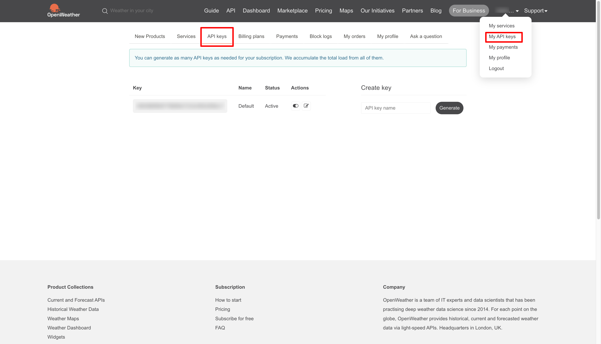
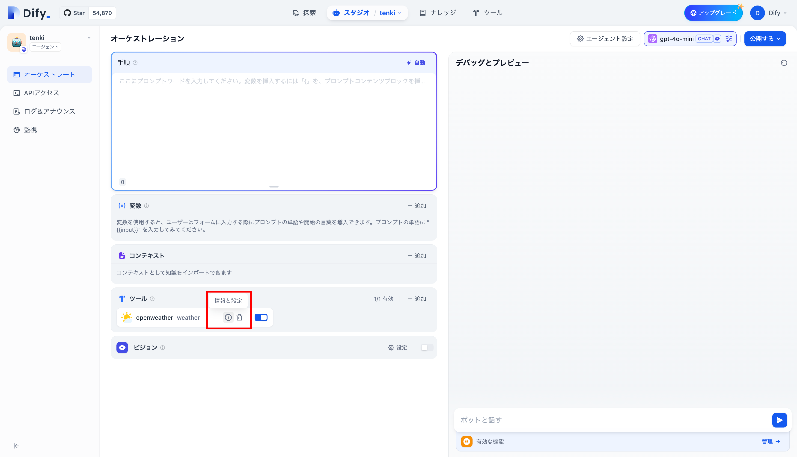
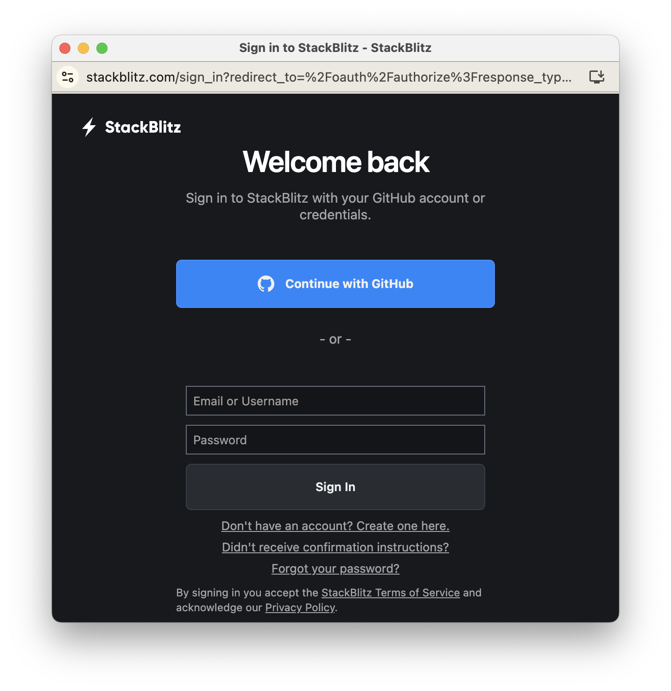

# 🤝 ハンズオン#2


by OpenAI DALL-E

[TOC]

## 3 限目前半

## 1. ▶️ イントロダクション

### 1.1. 🙋 出欠登録

### 1.2. 🧊⛏️ アイスブレイク

```
タイピング得意？
1. 得意
2. 普通
3. 苦手
```

```
mixi2どう思う？
1. よさそう
2. あんまり
3. 何それ
```

```
OpenAIのアドバンスト・ボイス・モード知ってる？
1. 使った
2. 知ってる
3. 何それ
```

### 1.3. 📌 コース概要

このコースの後半 7 回では、前半で身につけたデザイン思考やシステム設計開発のスキルをさらに発展し、ワークショップやハンズオン、ハッカソンを通して手を動かしながら、他者と協力し目の前の課題に深く向き合い解決方法を探る力を身につけます。


by OpenAI DALL-E

### 1.4. 📅 スケジュール

|   回数   |          1          |            2             |      3       |      4       |           5           |           6           |           7           |
| :------: | :-----------------: | :----------------------: | :----------: | :----------: | :-------------------: | :-------------------: | :-------------------: |
|   日程   |        11/27        |          12/04           |    12/11     |    12/18     |         12/25         |          1/8          |         1/15          |
|  テーマ  | Creative Hack Plus? | アジャイルワークショップ | ハンズオン#1 | ハンズオン#2 | ミニハッカソン#1 計画 | ミニハッカソン#2 実装 | ミニハッカソン#3 発表 |
| 担当講師 |        伊藤         |        伊藤、小島        |     伊藤     |     伊藤     |      伊藤、小島       |      伊藤、小島       |      伊藤、小島       |
|   場所   |      リモート       |        オンサイト        |   リモート   |   リモート   |      オンサイト       |      オンサイト       |      オンサイト       |

### 1.5. 👩‍💻 Creative Hack Plus と BTC (Business Technology Creative)

「Creative Hack Plus」は今まで学んだソリューションの呼び方を変えたもので、コース後半のテーマです。クリエイティブなアイデアや手法を活用して既存の問題を新たな視点で解決し、価値を創造することを指します。既存の枠組みにとらわれない「Creative」と「Hack」が本来持つ「効率的な解決法」や「機転を利かせた手段」という意味に「Plus」を加えることで、個人の課題解決にとどまらず、他者の課題解決や持続可能なビジネスモデルの提案へと発展させる意図を込めました。また、クロステックデザインコースで重視している BTC（Business Technology Creative）とも以下のように対応しています。

| **Creative Hack Plus** | **Business Technology Creative** | **説明**                                                                             |
| ---------------------- | -------------------------------- | ------------------------------------------------------------------------------------ |
| **Creative**           | Creative                         | 新しい視点や発想で問題を解決する創造性。                                             |
| **Hack**               | Technology                       | 技術を活かして迅速かつ柔軟に課題に取り組む姿勢。                                     |
| **Plus**               | Business                         | 個人の課題解決を越えた持続可能な価値創造、ビジネスモデルの構築、社会へのインパクト。 |

### 1.6. 🤖 前回振り返り

前回の授業では、**AI アプリ開発プラットフォーム「Dify」**を使用して、実際に AI アプリを開発しながら**アジャイル開発**について学びました。「関西弁チャットボット」や「授業レポート作成支援アプリ」などのテーマで **MVP** を意識したアプリ作成を行い、アプリケーション開発を体験しました。また、アジャイル開発の基本的な考え方や手法についても触れ、プロジェクトの方向性を共有する**インセプションデッキ**や**ビジネスモデルキャンバス**の概念を紹介しました。

### 1.7. 📋 本日の内容

---

## 2. 📚 前回の復習

- Dify の登録
- Google Gemini API の API key を取得
- AI アプリの開発
- アジャイル開発

> [!TIP]
> システムモデル設定
>
> デフォルトのモデル設定を選べます。


---

## 3. 🛠️ 応用編：プログラミング言語を用いた AI アプリ開発

このセクションでは、プログラミング言語を用いて生成 AI を呼び出し、簡易的なチャットアプリケーションを開発するプロセスを学びます。以下のステップを通じて、AI を活用したアプリ開発の基礎を実践的に理解します。


### 手順

1. **アーキテクチャの設計**

   - アプリケーション全体の構成を検討し、生成 AI とフロントエンド部分の連携を設計します。


2. **実行環境の準備**

   - [CodeSandbox](https://codesandbox.io/)を利用して、HTML、JavaScript、CSS を使ったフロントエンド開発環境を構築します。

3. **API の仕様または使用例の取得**

   - 使用する Gemini API のドキュメント（[チュートリアル: Gemini API のスタートガイド](https://ai.google.dev/gemini-api/docs/get-started/tutorial?lang=rest&hl=ja)等）を参照し、必要なエンドポイントや認証方法を確認します。

4. **生成 AI に具体的な指示を提供**

   - 「Gemini API を利用し、HTML、JavaScript、CSS を組み合わせたチャットアプリケーションを作成する」といった具体的な要件を生成 AI に伝えます。

5. **生成されたコードを CodeSandbox に貼り付け**

   - 提示されたコードを CodeSandbox にコピーペーストし、必要に応じて修正します。

6. **動作確認**
   - アプリケーションを実行して、生成 AI の応答やユーザーインターフェースの動作が期待通りかをテストします。

> [!IMPORTANT]
> API key を CodeSandbox のコード上に入力すると、API key が流出するのでご注意ください。
> プロダクション環境では、別途バックエンドサーバーやログインの仕組みが必要です。

## 4. 🖥️ プラットフォーム

このセクションでは、プログラミングを行わずに開発できるツールや、生成 AI を用いて効率的にプログラミングや開発を進められる環境を紹介します。初心者から上級者まで、目的に応じた適切なツールを選ぶことで、開発効率を大幅に向上させることが可能です。

### ノーコード・ローコード開発ツール

プログラミングの知識がなくても、簡単にアプリケーションを作成できるツールを紹介します。

- **AI アプリ開発ツール**

  - [Dify.AI](https://dify.ai/)
    AI を利用してアプリを素早く構築するためのプラットフォーム。
  - [Coze](https://www.coze.com/)
    次世代の AI アプリ開発向けプラットフォーム。
  - [GPTs](https://openai.com/index/introducing-gpts/)
    OpenAI によるカスタム GPT の構築プラットフォーム。

- **ノーコードツール**
  プログラミングなしでアプリを作成可能なプラットフォーム。直感的な UI やドラッグ&ドロップ機能を使って、業務アプリケーションやカスタムソリューションを簡単に構築できます。

  - [kintone（キントーン）」](https://kintone.cybozu.co.jp/)
    業務効率化に特化したクラウド型データベースプラットフォーム。チームでの情報共有やタスク管理を手軽に行えるカスタマイズ可能なアプリを作成可能です。

  - [Microsoft Power Apps](https://www.microsoft.com/ja-jp/power-platform/products/power-apps)
    Microsoft が提供するローコードアプリ開発プラットフォーム。Excel 感覚で使える直感的な UI と豊富な連携オプションで、ビジネスプロセスを効率化できます。

  - Salesforce
    顧客管理（CRM）に特化したクラウドプラットフォーム。ノーコードで営業、マーケティング、サービスなどのプロセスをカスタマイズしたアプリで支援します。

  - Bubble
    ビジュアルエディタを使って Web アプリケーションを開発できるプラットフォーム。データベース管理やレスポンシブデザインも簡単に構築可能で、スタートアップにも人気です。

- **iPaaS（Integration Platform as a Service）**
  複数のアプリやサービスを連携させ、自動化や効率化を実現するためのツール。API やトリガーを設定するだけで、異なるサービス間でデータのやり取りが可能になります。

  - [Zapier](https://zapier.com/)
    異なるアプリケーションをつなぎ、タスクを自動化するツール。例えば、Google フォームの入力内容を自動で Slack に通知するなど、ノーコードで簡単に設定できます。

  - [Make](https://www.make.com/en) （旧 Integromat）
    異なるアプリケーションをつなぎ、タスクを自動化するツール。例えば、Google フォームの入力内容を自動で Slack に通知するなど、ノーコードで簡単に設定できます。

  - iOS ショートカット
    Apple が提供する iOS デバイス用の自動化ツール。日常のタスクを効率化するためのカスタムワークフローを簡単に作成でき、ホーム画面からのワンタップで実行可能です。

- **IoT 開発ツール**
  簡単な IoT プロジェクトを実現するツール：
  - [MESH](https://meshprj.com/jp/)
    センサーやタグを使って簡単な IoT デバイスを構築。
  - toio
    子どもから大人まで楽しめるプログラミング教育ツール。

### プログラミング開発環境

生成 AI を活用したプログラミングや、クラウドベースでの開発環境を紹介します。

- **AI アシスト開発環境**

  - [v0](https://v0.dev/)
    生成 AI を統合した開発プラットフォーム。
  - Bolt.new
    生成 AI を統合した開発プラットフォーム。

- **AI コードアシスタント**
  コーディングを支援する AI ツール：

  - [GitHub Copilot](https://github.com/features/copilot)
    VSCode プラグインとして利用可能。
  - Cursor
    AI を活用した IDE
  - Continue
    オープンソースの AI プラグイン

- **オンライン開発環境**
  ブラウザ上で開発可能なツール：

  - [CodeSandbox](https://codesandbox.io/)
    フロントエンド開発向けの環境。
  - StackBlitz
    フロントエンド開発向けの環境。
  - CodePen
    フロントエンド開発向けの環境。
  - [Google Colaboratory](https://colab.google/)
    Python ベースのデータ分析・AI 開発に便利。

- **デプロイ環境**
  開発したアプリを公開するためのプラットフォーム：
  - クラウドサービス：AWS, Google Cloud, Azure
  - フロントエンド特化：Vercel, Netlify

---

## 3 限後半

---

## 5. 🌐 外部 API を活用した AI アプリ開発

このセクションでは、外部 API を活用して生成 AI（LLM）を利用するアプリに向けて API を学びます。

### 作るものの紹介

- **Dify による外部 API の呼び出し**
  Dify を使用して外部 API を呼び出し、生成 AI との連携を行います。

- **生成 AI（LLM: Large Language Model）によるデータの加工**
  外部 API で取得したデータを生成 AI で加工し、必要な形に整形します。

- **Bolt.new による画面の作成と Dify の API 呼び出し**
  Bolt.new を使い、簡易的な UI を作成し、Dify の API を統合します。

> [!TIP]
> Demo

### 使うもの

- **Dify** ([dify.ai](https://dify.ai))
  生成 AI のワークフロー構築と外部 API 連携を可能にするツール。

- **Bolt** ([bolt.new](https://bolt.new))
  AI を用いて簡単に UI を作成できる Web 開発ツール。

- **外部 API**
  必要なデータを取得するために使用する API（例: [PokéAPI](https://pokeapi.co/)）。

### 来週からのハッカソン予告

1. **アイデアを出す**
   生成 AI を活用したアプリのアイデアをグループで出し合います。

2. **Dify を使って MVP (プロトタイプ)を構築**
   ハッカソンで使う MVP の設計と構築を進めます。

3. **Bolt.new を使って UI を改善**
   ユーザーフレンドリーなインターフェースをデザインし、完成度を高めます。

### API とは？

- **Application Programming Interface**
  ソフトウェア同士がやり取りをするための「窓口」や「橋渡し」の役割を果たす仕組みです。開発者が特定の機能を利用しやすくなるように、仕様書として提供されます。

- **API の特徴**

  - ソフトウェアの部品化を促進し、再利用性を向上。
  - 他のサービスと簡単に統合できる。
  - 動的なデータ取得が可能。

- **Web API**
  インターネットを介して操作やデータ取得が可能な API のことです。例えば、天気情報や映画データベースの情報を取得する API があります。

### Web API の例

- [OpenWeatherMap](https://openweathermap.org/)
  天気や気温など、リアルタイムの気象データを取得可能です。

- [PokéAPI](https://pokeapi.co/)
  ポケモンのデータベースを利用できる API。名前や技などの情報を簡単に取得できます。

- [SWAPI - Star Wars API](https://pipedream.com/apps/swapi)
  スター・ウォーズのキャラクターや乗り物の情報を取得するための API。

### 注意点

- 著作物を扱う際は、**著作権**や**商標**に十分注意してください。
  参考: [ご利用について｜ポケットモンスターオフィシャルサイト](https://www.pokemon.co.jp/rules/)

## 6. 🔄 API 呼び出し

このセクションでは、Dify を活用して外部 API を呼び出し、エージェントでの活用方法を学びます。OpenWeather API を例に、API の取得からカスタムツール登録、エージェントでの呼び出しまでの手順を解説します。

### Dify のエージェントで OpenWeather API を利用

1. **API key の取得**

   - OpenWeather API の公式サイトに登録し、API キーを取得します。
   - 取得した API キーは後の手順で Dify のツール設定に使用します。

[Current weather and forecast - OpenWeatherMap](https://openweathermap.org/)



2. **ツールとして認証**

   - Dify の管理画面で API キーを登録し、ツールとして認証します。
   - 認証プロセスにより、Dify エージェントが API を利用可能になります。


3. **エージェントでの呼び出し**
   - Dify エージェントを使用して、必要なパラメータ（都市名）を設定します。
   - OpenWeather API にリクエストを送り、天気データを取得します。




### カスタムツール登録

1. **ツールとして取り込みたい API の仕様を取得**

   - API の公式ドキュメントを確認し、エンドポイントやパラメータ仕様を理解します。

2. **OpenAPI 仕様を用いたカスタムツール登録**
   - Dify の「カスタムツール登録」機能を使用し、 API の仕様を基に設定を行います。
   - OpenAPI 形式のスキーマをインポートすることで、簡単にカスタムツールを作成できます。
   - OpenAPI 形式のスキーマがない場合、API の具体例を LLM に渡し指示することで生成できます。

```
以下の情報から、OpenAPI yamlを作って

# URL
https://pokeapi.co/api/v2/pokemon-species/

# 例
## URL
https://pokeapi.co/api/v2/pokemon-species/pikachu

## response
```

例：
[pokeapi/openapi.yml at master · PokeAPI/pokeapi](https://github.com/PokeAPI/pokeapi/blob/master/openapi.yml)

以下のスキーマ部分に OpenAPI 仕様を記載する。


### エージェントでのカスタムツール呼び出し

- 登録したカスタムツールを Dify エージェントから呼び出します。
- 必要なリクエストパラメータを指定し、外部 API からのデータ取得を実行します。
- 取得したデータはエージェント内で生成 AI と連携させ、さらに加工や表示に活用します。


これにより、Dify を活用した外部 API 連携の一連の流れを体験し、アプリ開発における実践的なスキルを身につけることができます。

---

## 4 限前半

---

## 7. 🛠️ ワークフロー

このセクションでは、Dify を活用したワークフローの構築手法を学びます。シンプルな入力出力から始め、条件分岐やツール呼び出し、コードブロックの利用を通して複雑な処理の実装を体験します。最終的に LLM、カスタムツール、コードブロックを統合して、データ処理や API 活用を行います。

### ワークフローの構築手順

1. **シンプルな入力出力で LLM を呼び出す**

   - LLM を用いた基本的なワークフローを作成します。
   - 入力に対する応答を生成し、途中結果を確認することで期待通りの動作を確認します。

2. **条件分岐を使った LLM の切り替え**

   - 条件分岐を設定し、異なる入力条件に応じて別の LLM を呼び出します。
   - 分岐の動作が適切に行われるかテストを実施します。

3. **ツール呼び出し**

   - OpenWeather API などの外部ツールを呼び出してデータを取得します。
   - API の呼び出し結果を確認し、LLM に渡すデータとして活用します。

4. **コードブロックを利用**

   - 必要なデータをフィルタリングして取得するコードブロックを追加します。
   - Python スクリプトを使用して取得データを加工・整形します。

5. **LLM、カスタムツール、コードブロックの統合**
   - LLM、カスタムツール、コードブロックを組み合わせてワークフローを完成させます。
   - 各要素のデバッグを行い、動作が期待通りか確認します。

### ワークフローの構築

天気のワークフロー

条件分岐

コード実行


参考

```python
import json
def main(data: str) -> dict:
    data_dict = json.loads(data)
    result = None  # 初期値をNoneに設定
    for entry in data_dict.get('names', []):  # 'names'が存在しない場合の対策
        if entry['language']['name'] == 'ja':
            result = entry['name']
            break  # 条件に一致したらループを終了
    return {"result": result}
```

```python
import json
def main(data: dict) -> dict:
    data_dict = json.loads(data)

    # result = {}
    result = None
    for entry in data_dict['flavor_text_entries']:
        if entry['language']['name'] == 'ja':
            result = entry['flavor_text']
            break  # 条件に一致したらループを終了
            # result[entry['version']['name']] = entry['flavor_text']
    return {"result": result}
```

### ワークフローの成果

このプロセスを通じて、以下のスキルを習得できます：

- LLM を使ったシンプルなデータ処理
- 条件分岐を用いた動的な処理切り替え
- 外部 API の連携方法とデータ活用
- コードブロックでのデータ加工
- LLM とツール・スクリプトの統合

これらを組み合わせることで、複雑な処理を自動化した実践的な AI アプリケーションの開発が可能になります。

---

## 4 限後半

---

## 8. 🔗 Dify を API として呼び出す

このセクションでは、Dify を API として利用する方法を学びます。Bolt.new を活用し、Dify のワークフローを API として呼び出し、外部アプリケーションとの連携を実現します。また、API 利用時のセキュリティや制限についても解説します。

### Bolt.new の登録・制限

1. **アカウント作成**

[bolt.new](https://bolt.new/)からアカウントを作成します。




2. **利用**

プロンプトを入力し Web サイトを構築します。


### ワークフローを API として利用

1. **アーキテクチャ**

   - Dify で構築したワークフローを API として公開し、他のアプリケーションやシステムから利用できる構造を設計します。


2. **API キーの取得**

   - Dify 管理画面から API キーを発行します。このキーは認証に使用され、API のセキュリティを確保します。

3. **API キーの注意点**

   - API キーは個別のユーザーやアプリケーションに紐付けられた認証情報です。
   - 公開しないように注意し、必要に応じて再発行が可能な設定にしておきます。

4. **API の仕様を取得**

   - Dify が提供する API ドキュメントを参照し、エンドポイントやリクエスト形式、レスポンス仕様を確認します。


### Bolt.new から API 呼び出し

#### 手順

- Bolt.new を利用して、Dify の API を呼び出します。
- API キーはセキュリティ上、ユーザー入力を介して設定しまことにします。
- API キーをフロントエンド側のコードに埋め込むと世界に流出してしまいます。
- API key は、バックエンド側で保持し管理することが多いです。

#### プロンプト例

```
下記情報をもとにreact, typescriptでPokeAPIを用いた検索サービスを作ってください。

# 仕様
ユーザーからの入力をもとに以下のAPIを呼び出しキャラクターの説明と画像URLを取得し、表示する
モダンでシンプルでフラットデザイン
API Keyはユーザーが画面に入力する

# API仕様 ## request
curl -X POST 'https: //api.dify.ai/v1/workflows/run' \
--header 'Authorization: Bearer {api_key
}' \
--header 'Content-Type: application/json' \
--data-raw '{
"inputs": {"query": "オレンジ色で、火を吹き、空を飛ぶ"},
"response_mode": "blocking",
"user": "abc-123"
}'

## response
{
"workflow_run_id": "djflajgkldjgd",
"task_id": "9da23599-e713-473b-982c-4328d4f5c78a",
"data": {
"id": "fdlsjfjejkghjda",
"workflow_id": "fldjaslkfjlsda",
"status": "succeeded",
"outputs": {
"text": "| 名前       | リザードン |\n| ----------- | -------- |\n| 特徴       |  炎タイプのポケモン。非常に高い温度の炎を吐き、岩石を溶かすほどの威力を持つ。翼で空を飛び回り、強い相手を求めて戦う。戦闘経験を積むほど炎の温度が上昇するともいわれている。  メガシンカによってメガリザードンXとメガリザードンYになる。  |\n\n",
"image": "https://raw.githubusercontent.com/PokeAPI/sprites/master/sprites/pokemon/6.png\n"
},
"error": null,
"elapsed_time": 0.875,
"total_tokens": 3562,
"total_steps": 8,
"created_at": 1705407629,
"finished_at": 1727807631
}
}
```

以上により、Dify のワークフローを API として活用し、Bolt.new と統合できました。同じように API を用いることで Bolt.new 以外からもアクセス可能です。

## 9. 🔄 レトロスペクティブ

> [!IMPORTANT]
>
> 今日のハンズオンを Fun Done Learn で振り返ろう。

---

## 10. 🏁 まとめ

このハンズオンでは、生成 AI 活用スキルを実践的に学びました。Dify を利用した外部 API（OpenWeather API など）の呼び出しや、LLM を用いたデータ加工を体験。また、Bolt.new での UI 作成と Dify ワークフローを統合し、実際のアプリケーション構築を進行しました。API の仕組みやセキュリティの基礎知識も学び、ツールやコードを組み合わせた効率的な開発プロセスを習得しました。次回は、最後のハッカソンに取り組んでいきます。
