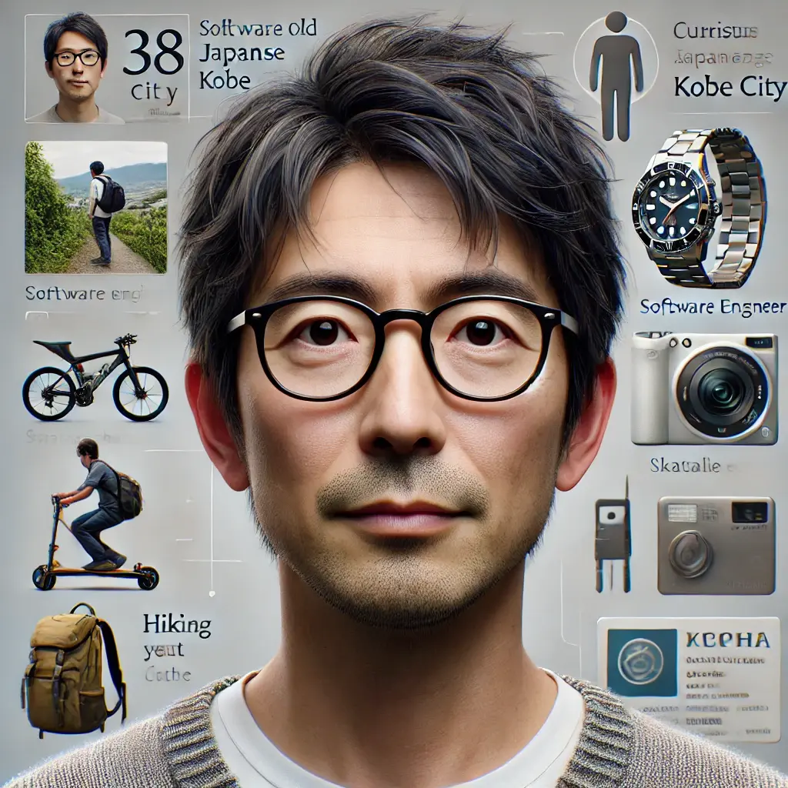

# ミニハッカソン#1


by OpenAI DALL-E

[TOC]

## 3 限目

## 1. ▶️ イントロダクション

### 1.1. 🙋 出欠登録

### 1.2. 🧊⛏️ アイスブレイク

### 1.3. 📌 コース概要

このコースの後半 7 回では、前半で身につけたデザイン思考やシステム設計開発のスキルをさらに発展し、ワークショップやハンズオン、ハッカソンを通して手を動かしながら、他者と協力し目の前の課題に深く向き合い解決方法を探る力を身につけます。


by OpenAI DALL-E

### 1.4. 📅 スケジュール

|   回数   |          1          |            2             |      3       |      4       |           5           |           6           |           7           |
| :------: | :-----------------: | :----------------------: | :----------: | :----------: | :-------------------: | :-------------------: | :-------------------: |
|   日程   |        11/27        |          12/04           |    12/11     |    12/18     |         12/25         |          1/8          |         1/15          |
|  テーマ  | Creative Hack Plus? | アジャイルワークショップ | ハンズオン#1 | ハンズオン#2 | ミニハッカソン#1 計画 | ミニハッカソン#2 実装 | ミニハッカソン#3 発表 |
| 担当講師 |        伊藤         |        伊藤、小島        |     伊藤     |     伊藤     |      伊藤、小島       |      伊藤、小島       |      伊藤、小島       |
|   場所   |      リモート       |        オンサイト        |   リモート   |   リモート   |      オンサイト       |      オンサイト       |      オンサイト       |

### 1.5. 👩‍💻 Creative Hack Plus と BTC (Business Technology Creative)

「Creative Hack Plus」は今まで学んだソリューションの呼び方を変えたもので、コース後半のテーマです。クリエイティブなアイデアや手法を活用して既存の問題を新たな視点で解決し、価値を創造することを指します。既存の枠組みにとらわれない「Creative」と「Hack」が本来持つ「効率的な解決法」や「機転を利かせた手段」という意味に「Plus」を加えることで、個人の課題解決にとどまらず、他者の課題解決や持続可能なビジネスモデルの提案へと発展させる意図を込めました。また、クロステックデザインコースで重視している BTC（Business Technology Creative）とも以下のように対応しています。

| **Creative Hack Plus** | **Business Technology Creative** | **説明**                                                                             |
| ---------------------- | -------------------------------- | ------------------------------------------------------------------------------------ |
| **Creative**           | Creative                         | 新しい視点や発想で問題を解決する創造性。                                             |
| **Hack**               | Technology                       | 技術を活かして迅速かつ柔軟に課題に取り組む姿勢。                                     |
| **Plus**               | Business                         | 個人の課題解決を越えた持続可能な価値創造、ビジネスモデルの構築、社会へのインパクト。 |

### 1.6. 🤖 前回振り返り

前回の授業では、生成 AI アプリを実践的に学びました。Dify を利用した外部 API（OpenWeather API など）の呼び出しや、LLM を用いたデータ加工を体験。また、Bolt.new での UI 作成と Dify ワークフローを統合し、実際のアプリケーション構築を進行しました。API の仕組みやセキュリティの基礎知識も学び、ツールやコードを組み合わせた効率的な開発プロセスを習得しました。

---

## 概要

### ハッカソン

ハッカソン（Hackathon）とは、**「ハック（Hack）」と「マラソン（Marathon）」**を組み合わせた言葉で、限られた期間内にプログラミングやアイデアを用いて何らかの課題を解決したり、新しいプロダクトやサービスを開発するイベントです。

課題解決のために、チームでアイデアを出し合い、Dify などの生成 AI ツールを活用してソリューションを作成します。その後、作成したソリューションを発表します。

### ハッカソンスケジュール

#### １日目

1. 説明＆チーム分け
2. アイデアだし
3. プロトタイピング
4. まとめ

#### 2 日目

1. 説明
2. デイリースタンドアップ
3. プロトタイピング
4. レトロスペクティブ

#### 3 日目

1. 説明
2. デイリースタンドアップ
3. プロトタイピング
4. レトロスペクティブ
5. 最終発表資料作成
6. 最終発表

### テーマ

- A. クリエイター支援
- B. 鑑賞者支援

### 本日のゴール

- アイデアをスライドにまとめて発表
- Dify を活用した生成 AI アプリケーションのアジャイル開発

## 課題

### 課題 A 「クリエイター支援」

#### 背景

クリエイターとして活動する学生たちは、作品制作に膨大な時間を費やし、アイデアの管理や制作プロセスの効率化に課題を抱えています。また、作品を評価・共有する場や、技術的なサポートを得る機会が不足しているため、創作活動が円滑に進まないことがあります。これらの課題を解決することで、クリエイターの成長を後押しし、創造的な環境を実現する必要があります。

#### 目的

学生がより効率的に作品制作に取り組み、クリエイティブな表現を最大限に発揮できる環境を整えることを目的とします。制作過程をサポートする仕組みを提案することで、学生の制作活動をより充実させます。

#### 課題

「クリエイターとして活動する学生の作品制作を支援するための具体的な解決策を提案する」

#### ペルソナ


```
名前: 山田 葵
年齢: 19 歳
家族構成: 実家暮らし（両親と姉）
居住地: 京都
職業: 京都芸術大学 プロダクトデザイン学科 1 年生
趣味: DIY、インテリアデザイン、カフェ巡り
性格: 明るく創造的だが、整理整頓が苦手
```

### 課題 B 「鑑賞者支援」

#### 背景

学園祭のアンケートで「アートの楽しみ方がわからない」という声があり、サポートの必要性が明らかになりました。学生の作品が十分に広まっていない現状を改善し、アートを身近にすることを目指します。

#### 目的

学生のアート作品を鑑賞者が深く楽しめる仕組みを作り、アートの価値を広めることで、作り手と鑑賞者双方に新たな価値を生み出します。

#### 課題

作品の背景や意図を伝える情報が不足し、作り手と鑑賞者の交流機会も限られています。この課題を解決し、アートをもっと身近にする必要があります。

#### ペルソナ



```
名前: 糸尾 直太朗
年齢: 38 歳
家族構成: 妻と小学生の子ども 2 人
居住地: 神戸市
職業: ソフトウェアエンジニア
趣味: ハイキング、スケボー、電子工作
性格: 好奇心旺盛で技術好きだが、アートについては初心者。子どもと楽しめる活動を探している。
```

## 発表テンプレート

以下のテンプレートで発表お願いします。

[Creative Hack Plus 発表テンプレート](https://docs.google.com/presentation/d/1VLoHF9dT9qvqoKzxvgExliqiNOglSkEI_gY6861W9cQ/edit#slide=id.g1f87997393_0_782)

## チーム分け

Slack にて共有します。

## アイデアだし 85 分

発表テンプレートの情報をうめられるように、チームでアイデアを出してください。

### チーム紹介 10 分

資料を作りながら、実施してください。

画像もお願いします。（生成 AI 使ってくれても ok です。）

### 課題の選定と深掘り 20 分

2 つのうち、どちらにするか話し合ってください。

決まったら、ペルソナについて話し合い、課題を深掘りしてください。

### 休憩 5 分

### 解決策の策定 20 分

できるだけたくさんのアイデアを出して、チームで一つに決めてください。

やり方は任せます。

#### 参考

1. アイデアだし
2. グルーピング
3. 気に入ったものと実現できそうなもの（生成 AI を使えそうなもの）に投票
4. ディスカッション

### 資料作成 10 分

足りていない部分を記入してください。

### 発表 20 分

質問やコメントを考えながら他のチームの発表を聞いてください。

## 4 限目

### レトロスペクティブ 20 分

[レトロスペクティブ](https://github.com/Creative-Cucumbers/creative-hack-plus/tree/main/2024/3_handson1#42-%EF%B8%8F-%E3%82%B9%E3%83%97%E3%83%AA%E3%83%B3%E3%83%88%E3%83%AC%E3%83%88%E3%83%AD%E3%82%B9%E3%83%9A%E3%82%AF%E3%83%86%E3%82%A3%E3%83%96%E6%8C%AF%E3%82%8A%E8%BF%94%E3%82%8A)

アジャイル開発において、チームが過去のスプリントやプロジェクトの振り返りを行い、改善点を見つけ出すためのミーティング

[KPT](https://github.com/Creative-Cucumbers/creative-hack-plus/tree/main/2024/3_handson1#-kpt-keep-problem-try) で、振り返りをして次の具体的なアクションを決めてください。

アイデアだけでなく、進め方についても振り返ってみてください。

アイデアは変更して OK です。

終わったら、他のチームに共有します。

### プロトタイピング 30 分

Dify で作ってみてください。

どうやって実現するか等、気軽に相談してください。

### 休憩 5 分

### デモ 20 分

質問やコメントを考えながら他のチームの発表を聞いてください。

### レトロスペクティブ 20 分

[KPT](https://github.com/Creative-Cucumbers/creative-hack-plus/tree/main/2024/3_handson1#-kpt-keep-problem-try) で、振り返りをして次の具体的なアクションを決めてください。

ソリューションだけでなく、進め方についても振り返ってみてください。

次回に向けて、ぜひアイデアを修正・拡張してください。

終わったら、他のチームに共有します。

## まとめ 5 分

本日の内容と前回までの授業内容を振り返り、次回の進め方を確認します。
