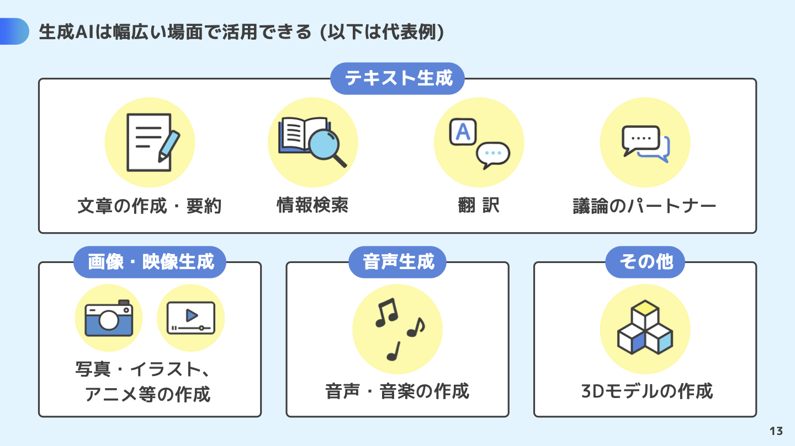

# ミニハッカソン#2


by OpenAI DALL-E

[TOC]

## 3 限目

## 1. ▶️ イントロダクション

### 1.1. 🙋 出欠登録

### 1.2. 🧊⛏️ アイスブレイク

### 1.3. 📌 コース概要

このコースの後半 7 回では、前半で身につけたデザイン思考やシステム設計開発のスキルをさらに発展し、ワークショップやハンズオン、ハッカソンを通して手を動かしながら、他者と協力し目の前の課題に深く向き合い解決方法を探る力を身につけます。


by OpenAI DALL-E

### 1.4. 📅 スケジュール

|   回数   |          1          |            2             |      3       |      4       |           5           |           6           |           7           |
| :------: | :-----------------: | :----------------------: | :----------: | :----------: | :-------------------: | :-------------------: | :-------------------: |
|   日程   |        11/27        |          12/04           |    12/11     |    12/18     |         12/25         |          1/8          |         1/15          |
|  テーマ  | Creative Hack Plus? | アジャイルワークショップ | ハンズオン#1 | ハンズオン#2 | ミニハッカソン#1 計画 | ミニハッカソン#2 実装 | ミニハッカソン#3 発表 |
| 担当講師 |        伊藤         |        伊藤、小島        |     伊藤     |     伊藤     |      伊藤、小島       |      伊藤、小島       |      伊藤、小島       |
|   場所   |      リモート       |        オンサイト        |   リモート   |   リモート   |      オンサイト       |      オンサイト       |      オンサイト       |

### 1.5. 👩‍💻 Creative Hack Plus と BTC (Business Technology Creative)

「Creative Hack Plus」は今まで学んだソリューションの呼び方を変えたもので、コース後半のテーマです。クリエイティブなアイデアや手法を活用して既存の問題を新たな視点で解決し、価値を創造することを指します。既存の枠組みにとらわれない「Creative」と「Hack」が本来持つ「効率的な解決法」や「機転を利かせた手段」という意味に「Plus」を加えることで、個人の課題解決にとどまらず、他者の課題解決や持続可能なビジネスモデルの提案へと発展させる意図を込めました。また、クロステックデザインコースで重視している BTC（Business Technology Creative）とも以下のように対応しています。

| **Creative Hack Plus** | **Business Technology Creative** | **説明**                                                                             |
| ---------------------- | -------------------------------- | ------------------------------------------------------------------------------------ |
| **Creative**           | Creative                         | 新しい視点や発想で問題を解決する創造性。                                             |
| **Hack**               | Technology                       | 技術を活かして迅速かつ柔軟に課題に取り組む姿勢。                                     |
| **Plus**               | Business                         | 個人の課題解決を越えた持続可能な価値創造、ビジネスモデルの構築、社会へのインパクト。 |

### 1.6. 🤖 前回振り返り

前回の授業では、ハッカソン#1 として、アイデア出しからアプリ開発までの一連のプロセスを体験しました。ハッカソンは「ハック（Hack）」と「マラソン（Marathon）」を組み合わせたイベントで、限られた時間内に課題を解決し、新しいプロダクトやサービスを開発することを目的としています。授業では、アジャイル開発の基本を学びながら、Dify や Bolt.new といった生成 AI ツールを活用し、チームでアイデアを出し合い、ソリューションを作成して発表する一連の流れを実践しました。

---

## 説明 20 分

### ハッカソンスケジュール

#### １日目

1. 説明＆チーム分け
2. アイデアだし
3. プロトタイピング
4. まとめ

#### 2 日目

1. 説明
2. アイデアだし#2
3. プロトタイピング#2
4. デモ

#### 3 日目

1. 説明
2. アイデアだし#3
3. プロトタイピング#3
4. 最終発表資料作成
5. 最終発表

### テーマ

- A. クリエイター支援
- B. 鑑賞者支援

### 本日のゴール

- アイデアを更新しスライドにまとめて発表
- Dify と Bolt.new を活用した **生成 AI アプリケーション** v2 のアジャイル開発

### 課題

[creative-hack-plus/2024/4_handson2 at main · Creative-Cucumbers/creative-hack-plus](https://github.com/Creative-Cucumbers/creative-hack-plus/tree/main/2024/4_handson2)

### 発表テンプレート

以下のテンプレートで発表お願いします。

[Creative Hack Plus 発表テンプレート](https://docs.google.com/presentation/d/1VLoHF9dT9qvqoKzxvgExliqiNOglSkEI_gY6861W9cQ/edit#slide=id.g1f87997393_0_782)

### 事前準備 15 分

#### アイデア出しの原則 5 分

##### ✍️ 話す前に書いてみる

自分の考えをまず書き出して、アイデアを整理しましょう。

##### 📝 全員が記入する

参加者全員がアイデアを記入して、意見を平等に出し合います。

##### 🎯 質より量

たくさんのアイデアを出すことを目指しましょう。最初から完璧を求めなくて OK！

##### 🤝 お互いをリスペクト

他人の意見やアイデアを尊重し、批判を控えましょう。

##### 😂 バカバカしいアイデア

笑えるくらい突拍子もないアイデアも大歓迎！そこから良い発想が生まれます。

##### 🎉 リアクションする

アイデアに「面白い！」「いいね！」とポジティブな反応を示しましょう。

##### ❌ 出して悪いアイデアはない

どんなアイデアでも価値があります。否定することはありません。

##### ❓ 気軽に質問

わからないことはすぐに質問して、深掘りしましょう。

##### ⚖️ 参加者全員が平等

全員が発言の機会を持ち、声を上げやすい環境を作ります。

#### 課題に対する解決策としての生成 AI 5 分

今回、生成 AI を活用したソリューションを検討してもらいます。
ここで、生成 AI について振り返りたいと思います。

```
生成AIの活用方法について教えて
```



- [生成 AI はじめの一歩～生成 AI の入門的な使い方と注意点～ | 安心・安全なインターネット利用ガイド | 総務省](https://www.soumu.go.jp/use_the_internet_wisely/special/generativeai/)
- [生成 AI はじめの一歩](https://www.soumu.go.jp/use_the_internet_wisely/special/generativeai/data/file01.pdf)

#### ユーザーストーリー説明 5 分

ユーザーストーリーとは、ソフトウェア開発における要求や機能を簡単に説明するための短い文章です。ユーザーの視点から、「誰が」「何をしたいか」「なぜそれが必要か」を記述し、開発チームが実現すべき価値を共有するために使われます。

この後のワークで、「生成 AI を活用した機能のユーザーストーリー」を作成してもらいます。

[creative-hack-plus/2024/3_handson1 at main · Creative-Cucumbers/creative-hack-plus](https://github.com/Creative-Cucumbers/creative-hack-plus/tree/main/2024/3_handson1#%EF%B8%8F-%E3%83%A6%E3%83%BC%E3%82%B6%E3%83%BC%E3%82%B9%E3%83%88%E3%83%BC%E3%83%AA%E3%83%BC%E3%83%9E%E3%83%83%E3%83%94%E3%83%B3%E3%82%B0)

以下に、TODO アプリのユーザーストーリーの例を示します。

```
＜ Who ＞ ユーザーとして、
＜ What ＞ タスクをすぐに追加したい。
＜ Why ＞ やるべきことを忘れないため。

＜ Who ＞ ユーザーとして、
＜ What ＞ タスクを編集したい。
＜ Why ＞ 予定変更に対応するため。

＜ Who ＞ ユーザーとして、
＜ What ＞ タスクの完了を記録したい。
＜ Why ＞ 進捗を把握するため。

＜ Who ＞ ユーザーとして、
＜ What ＞ タスクを削除したい。
＜ Why ＞ リストを整理するため。

＜ Who ＞ ユーザーとして、
＜ What ＞ 期限とリマインダーを設定したい。
＜ Why ＞ 締め切りを守るため。
```

実際は、チームが認識をそろえるために、例えば下記のような基準（INVEST）で記載します。

##### Independent（独立している）

他のストーリーに依存しないことで、自由に優先順位を変更できる。

##### Negotiable（柔軟である）

内容を固めすぎず、開発チームと相談して詳細を詰められる。

##### Valuable（価値がある）

ユーザーやビジネスに具体的な価値を提供する。

##### Estimable（見積もれる）

必要な作業量や時間を見積もれるくらい具体的である。

##### Small（小さい）

1 つのスプリントで完了できるくらいシンプルである。

##### Testable（テスト可能）

完了条件が明確で、テストで達成度を確認できる。

#### 振り返り 15 分

## 休憩 5 分

## 解決アイデアだし#2 30 分

- チームで解決アイデアを出し合い、新たな発想を引き出します。

### AI 活用アイデア 15 分

- AI を活用した具体的な解決アイデアを考えます。

### ユーザーストーリー作成・整理 15 分

- ユーザーのニーズに基づいたシナリオを作成し、解決アイデアを具体化します。

## プロトタイピング#2 Dify 編 25 分

- Dify を使用して、アイデアをプロトタイプとして形にします。

### モブプログラミング

モブプログラミング（Mob Programming）は、ソフトウェア開発のチームワーク手法の一つで、チーム全員が一つのコンピュータに集まり、共同でコードを書くというアプローチです。この方法は、アジャイル開発の価値観や原則に基づいており、チームの連携と共同作業を最大化することを目的としています。

### Dify

Dify は、生成 AI や外部サービスを統合した生成 AI アプリケーションを構築するためのプラットフォームです。

[creative-hack-plus/2024/3_handson1 at main · Creative-Cucumbers/creative-hack-plus](https://github.com/Creative-Cucumbers/creative-hack-plus/tree/main/2024/3_handson1#2--ai-%E3%82%A2%E3%83%97%E3%83%AA%E9%96%8B%E7%99%BA%E3%83%84%E3%83%BC%E3%83%AB)

以下のような機能を実装できます：

#### システムプロンプトの設定

カスタマイズしたプロンプトを用意し、AI の動作を制御できます。

#### 参照情報の構築

必要な情報を事前に登録し、AI が回答時に活用できるようにします。

#### 画像入力

画像データを入力し、それを基に AI が処理や分析を行えます。

#### 外部ツール（API）の統合

他のサービスや API を組み込み、アプリの機能を拡張できます。

#### ワークフローの構築

タスクやプロセスを自動化するワークフローを設計・実装できます。

## 休憩 20 分

## 4 限目

### プロトタイピング#2 Bolt.new 編 25 分

- Bolt.new を活用して、プロトタイプをさらに進化させます。

#### Bolt.new

Bolt.new は、 AI を活用して素早くアプリを開発し、公開できるサービスです。

[creative-hack-plus/2024/4_handson2 at main · Creative-Cucumbers/creative-hack-plus](https://github.com/Creative-Cucumbers/creative-hack-plus/tree/main/2024/4_handson2#8--dify-%E3%82%92-api-%E3%81%A8%E3%81%97%E3%81%A6%E5%91%BC%E3%81%B3%E5%87%BA%E3%81%99)

Bolt.new には以下の機能が含まれています：

##### チャット形式によるコーディング

AI との対話を通じて、コードを書いたり修正したりできます。

##### コードの実行

作成したコードをその場で実行し、結果を確認できます。

##### エラーの修正

エラーを自動で検出し、修正の提案を受けることができます。

##### ブラウザでの開発環境

特別なソフトウェアをインストールせず、ブラウザ上で開発が完結します。

##### デプロイ

開発したアプリを簡単にデプロイし、すぐに公開できます。

### プロトタイピング#2 修正 編 20 分

- フィードバックを反映し、プロトタイプを調整します。

## 休憩 5 分

## デモ準備 20 分

- プレゼン用にデモを整えます。スライドや実演の準備を行います。

## デモ 20 分

- チームや関係者に向けて、成果を発表しフィードバックを受けます。

## まとめ 5 分

- 一日の作業を振り返り、次に進むためのポイントを確認します。
