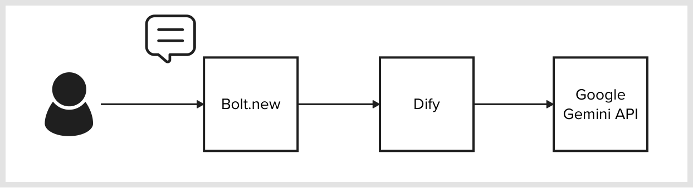
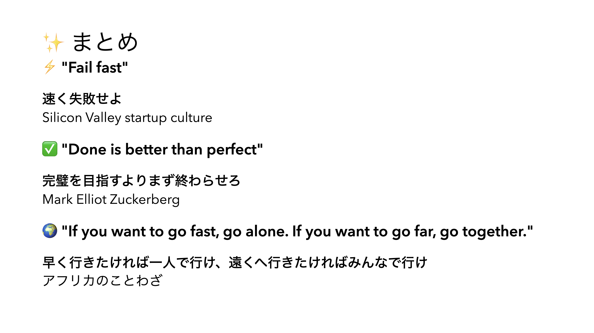

# ミニハッカソン#3


by OpenAI DALL-E

[TOC]

## 3 限目

## 1. ▶️ イントロダクション 5 分

### 1.1. 🙋 出欠登録

### 1.2. 📌 コース概要

このコースの後半 7 回では、前半で身につけたデザイン思考やシステム設計開発のスキルをさらに発展し、ワークショップやハンズオン、ハッカソンを通して手を動かしながら、他者と協力し目の前の課題に深く向き合い解決方法を探る力を身につけます。


by OpenAI DALL-E

### 1.3. 📅 スケジュール

|   回数   |          1          |            2             |      3       |      4       |           5           |           6           |           7           |
| :------: | :-----------------: | :----------------------: | :----------: | :----------: | :-------------------: | :-------------------: | :-------------------: |
|   日程   |        11/27        |          12/04           |    12/11     |    12/18     |         12/25         |          1/8          |         1/15          |
|  テーマ  | Creative Hack Plus? | アジャイルワークショップ | ハンズオン#1 | ハンズオン#2 | ミニハッカソン#1 計画 | ミニハッカソン#2 実装 | ミニハッカソン#3 発表 |
| 担当講師 |        伊藤         |        伊藤、小島        |     伊藤     |     伊藤     |      伊藤、小島       |      伊藤、小島       |      伊藤、小島       |
|   場所   |      リモート       |        オンサイト        |   リモート   |   リモート   |      オンサイト       |      オンサイト       |      オンサイト       |

### 1.4. 👩‍💻 Creative Hack Plus と BTC (Business Technology Creative)

「Creative Hack Plus」は今まで学んだソリューションの呼び方を変えたもので、コース後半のテーマです。クリエイティブなアイデアや手法を活用して既存の問題を新たな視点で解決し、価値を創造することを指します。既存の枠組みにとらわれない「Creative」と「Hack」が本来持つ「効率的な解決法」や「機転を利かせた手段」という意味に「Plus」を加えることで、個人の課題解決にとどまらず、他者の課題解決や持続可能なビジネスモデルの提案へと発展させる意図を込めました。また、クロステックデザインコースで重視している BTC（Business Technology Creative）とも以下のように対応しています。

| **Creative Hack Plus** | **Business Technology Creative** | **説明**                                                                             |
| ---------------------- | -------------------------------- | ------------------------------------------------------------------------------------ |
| **Creative**           | Creative                         | 新しい視点や発想で問題を解決する創造性。                                             |
| **Hack**               | Technology                       | 技術を活かして迅速かつ柔軟に課題に取り組む姿勢。                                     |
| **Plus**               | Business                         | 個人の課題解決を越えた持続可能な価値創造、ビジネスモデルの構築、社会へのインパクト。 |

### 1.5. 🤖 前回振り返り

前回までの授業では、ハッカソン#1-2 として、アイデア出しからアプリ開発までの一連のプロセスを体験しました。ハッカソンは「ハック（Hack）」と「マラソン（Marathon）」を組み合わせたイベントで、限られた時間内に課題を解決し、新しいプロダクトやサービスを開発することを目的としています。授業では、アジャイル開発の基本を学びながら、Dify や Bolt.new といった生成 AI ツールを活用し、チームでアイデアを出し合い、ソリューションを作成して発表する一連の流れを実践しました。

---

## 事前準備 25 分

### ハッカソンスケジュール

#### １日目

1. 説明＆チーム分け
2. アイデアだし
3. プロトタイピング
4. まとめ

#### 2 日目

1. 説明
2. アイデアだし#2
3. プロトタイピング#2
4. デモ

#### 3 日目

1. 説明
2. プロトタイピング#3
3. 個人アイデアだし
4. 個人プロトタイピング
5. 個人発表

### テーマ

- A. クリエイター支援
- B. 鑑賞者支援

### 本日のゴール

- Dify で作ったものと Bolt.new で作ったものを組み合わせる
- 個人で、生成 AI を使った追加のアイデアを出して Dify を使って実装する

### 課題

ハッカソン

[creative-hack-plus/2024/5_hackathon1 at main · Creative-Cucumbers/creative-hack-plus](https://github.com/Creative-Cucumbers/creative-hack-plus/tree/main/2024/5_hackathon1)

### 発表テンプレート

以下のテンプレートで発表お願いします。

[Creative Hack Plus 発表テンプレート](https://docs.google.com/presentation/d/1VLoHF9dT9qvqoKzxvgExliqiNOglSkEI_gY6861W9cQ/edit#slide=id.g1f87997393_0_782)

### 🧊⛏️ アイスブレイク 10 分

チームになって、最近食べておいしかったものを共有してください。

### デイリースタンドアップ 10 分

アジャイル開発におけるデイリースタンドアップ (Daily Stand-up) とは、チーム全員が毎日短時間（通常 15 分以内）で集まり、進捗を確認し、問題点を共有するミーティングのことです。

#### 目的

- チーム全体で進捗を共有する
- 各メンバーが抱えている課題や障害を明確にする
- その日のタスクの優先順位を確認する

#### ミーティングでのポイント

参加者は以下の 3 つの質問に答える形式で話すことが一般的です：

- **昨日やったこと**：チームの目標に対して、昨日取り組んだタスクを簡単に報告します。
- **今日やること**：その日に予定しているタスクを共有します。
- **障害や課題**：作業を妨げている問題や、他のメンバーの助けが必要な課題を伝えます。

#### 特徴

- **立ったまま行う**（だから「スタンドアップ」）：参加者が座らずに行うことで、ミーティングがダラダラと長引かないようにします。
- **短時間で終了**：必要以上に議論を深めず、重要な共有事項に集中します。議論が必要な場合は、ミーティング後に関係者だけで話し合います。
- **毎日決まった時間と場所で開催**：一貫性を保ち、全員が参加しやすくするため、時間と場所を固定することが重要です。

#### メリット

- チームメンバー全員がプロジェクトの進捗状況を把握できる。
- 問題が早期に発見され、迅速に対処できる。
- メンバー間のコミュニケーションを促進し、連携を強化できる。

## 休憩 5 分

## API 連携 45 分

### API 連携とは 10 分

Bolt.new から、Dify で作った AI 機能を API として呼び出し統合します。

#### 参考



[creative-hack-plus/2024/4_handson2 at main · Creative-Cucumbers/creative-hack-plus](https://github.com/Creative-Cucumbers/creative-hack-plus/tree/main/2024/4_handson2#8--dify-%E3%82%92-api-%E3%81%A8%E3%81%97%E3%81%A6%E5%91%BC%E3%81%B3%E5%87%BA%E3%81%99)

#### プロンプト例

```

以下の情報をもとに、Dify API を利用したサービスを作成してください。

# サービス概要
クリエイターをAIを使って支援するWEBサービス
Dify APIを利用してAIとのチャット機能を提供する


# 注意事項
API keyはユーザーが入力するようにしてください。

# Dify API

## 機能

## 呼び出し方

## レスポンス


```

### API 連携実践 25 分

前回作成した Bolt.new を使ったアプリケーションに Dify API を利用するように指示を出し連携させてください。

Bolt.new への指示は初めから作り直してください。

### API 連携デモ 10 分

他のチームの発表に対して質問してください。

## 休憩 20 分

## 4 限目

## アジャイル開発 5 分

### アジャイル宣言の背後にある原則抜粋

- **顧客満足**を最優先し、価値のあるソフトウェアを早く継続的に提供します。

- **動くソフトウェア**こそが進捗の最も重要な尺度です。

- チームがもっと効率を高めることができるかを**定期的に振り返り**、それに基づいて自分たちのやり方を**最適に調整**します。

参考：
[アジャイル宣言の背後にある原則](https://agilemanifesto.org/iso/ja/principles.html)

### 参考：マシュマロチャレンジ



## 課題説明 10 分

Dify の以下の 1 - 5 の機能を用いて、各機能ごとに AI 活用アイデアをそれぞれ考え、実装してください。また、作成したものをスライドにまとめてください。

アイデアの質よりも動くものを提供することを重視してください。
最低一つですが、評価項目となるため、できるだけ多くの機能を実装してください。

1. [チャット機能](https://github.com/Creative-Cucumbers/creative-hack-plus/tree/main/2024/3_handson1#24--%E3%83%81%E3%83%A3%E3%83%83%E3%83%88%E6%A9%9F%E8%83%BD%E3%81%AE%E9%96%8B%E7%99%BA)
2. [変数](https://github.com/Creative-Cucumbers/creative-hack-plus/blob/main/2024/3_handson1/readme.md#41--%E6%A9%9F%E8%83%BD-1%E6%8E%88%E6%A5%AD%E3%83%AC%E3%83%9D%E3%83%BC%E3%83%88%E4%BD%9C%E6%88%90%E6%94%AF%E6%8F%B4%E3%82%A2%E3%83%97%E3%83%AA)
3. [画像入力](https://github.com/Creative-Cucumbers/creative-hack-plus/tree/main/2024/3_handson1#42-%EF%B8%8F-%E6%A9%9F%E8%83%BD-2%E4%BD%9C%E5%93%81%E3%83%80%E3%83%A1%E5%87%BA%E3%81%97%E3%82%A2%E3%83%97%E3%83%AA)
4. [文章の取り込みと検索](https://github.com/Creative-Cucumbers/creative-hack-plus/tree/main/2024/3_handson1#43--%E6%A9%9F%E8%83%BD-3%E6%A4%9C%E7%B4%A2%E3%81%A7%E6%8B%A1%E5%BC%B5%E3%81%97%E3%81%9F%E3%83%81%E3%83%A3%E3%83%83%E3%83%88%E3%82%A2%E3%83%97%E3%83%AA)
5. [外部ツール活用](https://github.com/Creative-Cucumbers/creative-hack-plus/blob/main/2024/3_handson1/readme.md#44--%E6%A9%9F%E8%83%BD-4web-%E3%82%B5%E3%82%A4%E3%83%88%E7%90%86%E8%A7%A3%E4%BF%83%E9%80%B2%E3%82%A2%E3%83%97%E3%83%AA)

## 解決策アイデアだし 10 分

生成 AI を活用してアイデアだしを実施してください。

プロンプト例

```
クリエイター支援サービスで、Difyの以下の機能を用いたAI活用アプリの機能案を出して

1. チャット機能
2. 変数
3. 画像入力
4. 文章の取り込みと検索
5. 外部ツール活用
```

## プロトタイピング 30 分

気軽に質問してください。

## 休憩 5 分

## 発表 30 分

成果を発表しフィードバックを受けます。

## まとめ 10 分

改めてですが、生成 AI は今やトップレベルの専門家にも匹敵するほど進化しています。これからも AI はさらに発展し、私たちの生活や仕事のあり方に大きな変化をもたらすでしょう。AI が多くのタスクを代替する一方で、授業を通じて皆さんが体験した「ユーザーの課題解決」「アジャイルな思考」「チームでプロジェクトを進めるスキル」は、AI 時代でも変わらず求められる、汎用的で重要なスキルです。

ソフトウェアを用いたデジタルサービスは、

Business としてはスケールしやすく、
Technology としては AI をはじめ無限の可能性を秘め、
Creative としては IoT や AR/VR と組み合わせ、豊かな表現が可能です。
これらの特性により、まだまだ楽しみが広がる分野だと思います。

授業が終わっても、アプリ開発やその他の疑問があれば、いつでも気軽に連絡してください。そして最後に、マシュマロチャレンジでお伝えした以下の 3 つの言葉を、ぜひ心に留めておいてください。

これからも皆さんの挑戦を応援しています！


